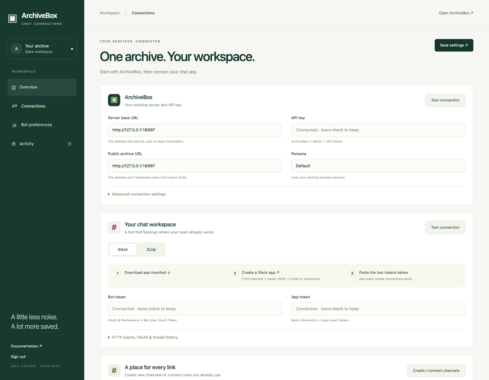
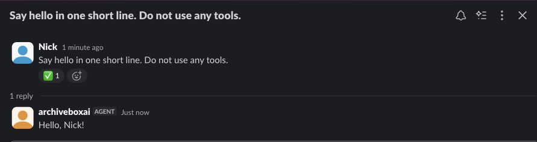

<div align="center">

# 📚 ArchiveBox for Slack

### Your team’s links, with a permanent home.

**Share a link · Save a thread · Talk to your archive**

[](https://github.com/ArchiveBox/archivebox-slack/actions/workflows/check.yml)
[](LICENSE)


[Get connected](#-get-connected) · [What it does](#-quiet-by-default) · [AI assistant](#-meet-archiveboxai) · [Zulip](#-zulip-too) · [Development](#-development)


</div>

## ✨ Quiet by default

| You do this | ArchiveBox does this |
|---|---|
| Post text in **#new-urls** | Extract HTTP(S) URLs → create `Crawl.urls`, depth **0** → tag **slack + sender’s name** |
| **@archivebox** in a thread | Read the **last 10 preceding human messages** + your mention → save their links |
| **DM** links to the bot | Queue a capture immediately |
| Wait for a snapshot to seal | Post **one saved card**: linked title, original URL, screenshot, favicon, database size, persona |
| Ask **@archiveboxai** a question | Start a session in your existing ArchiveBox OpenCode instance |

**🏃 Working → ✅ Saved / ❌ Needs attention**

- 🤫 Capture mentions and DMs get **reactions only**.
- ↔️ Saved cards and command replies use **one compact text line**; media links use **📷 / 🌐**.
- 🎛️ Every feature is independently switchable.
- 👤 User/channel allowlists, guest controls, trusted AI users, enabled commands.
- 🔐 Private ArchiveBox? Images are fetched securely and uploaded to chat.
- 💾 Durable inbox/outbox; duplicate delivery events do not create duplicate jobs.
- 🧭 Original connection identity stays attached to pending work.

## 🚀 Get connected

**Already running ArchiveBox?** Bring its **base URL + admin API key**, then connect Slack.

```bash
git clone https://github.com/ArchiveBox/archivebox-slack.git
cd archivebox-slack
docker compose up -d --build
docker compose exec archivebox-slack cat /data/admin-password
```

Open **[localhost:8001](http://localhost:8001)** → sign in with the generated password.

| ① ArchiveBox | ② Slack | ③ Channels |
|---|---|---|
| Enter **server URL + API key** | Click **Create preconfigured Slack app** | Click **Create / connect channels** |
| Click **Test connection** | Choose your workspace → create → **Install → Allow** | Share your first link |
| Pick an existing persona | Paste **bot token** + **app token** | Watch **#saved-urls** |

**Slack token locations**

- `xoxb-…` → **OAuth & Permissions → Bot User OAuth Token**
- `xapp-…` → **Basic Information → App-Level Tokens** → scope `connections:write`
- Invite `@archivebox` into any additional channel where you want thread capture.
- Socket Mode is the default: **no public webhook, tunnel, or inbound port**.

<details>
<summary><b>Starting ArchiveBox alongside the bot</b></summary>

```bash
docker compose --profile archivebox up -d --build
```

- Open **[localhost:5797](http://localhost:5797)** and finish ArchiveBox setup.
- Create an admin API token in ArchiveBox.
- Console → server URL: **`http://archivebox:5797`**.
- Console → public URL: **`http://localhost:5797`**, or the URL teammates use.
- Uses the current ArchiveBox **`dev`** image and its authenticated API.

</details>

<details>
<summary><b>Existing server / existing Compose project</b></summary>

- Remote server: enter its normal HTTPS URL.
- Server on the Docker host: use `http://host.docker.internal:5797` internally.
- Same Compose network: use `http://archivebox:5797` internally.
- **Public archive URL** controls links teammates click; Docker service names are not public links.
- Separate ArchiveBox admin hostname? Standard `api.` / `web.` → `admin.` discovery is automatic; an internal admin override is available.
- Copy the `archivebox-slack` service into your Compose project, preserving its build path and `/data` volume.
- Run **one bridge process** per data volume.

</details>



## 🎛️ Make it yours

| Setting | Default |
|---|---|
| New URLs / Saved URLs / mentions / DMs | **On** |
| Screenshot + favicon uploads | **On** |
| Crawl depth | **0** |
| Tags | **slack**, sender display name |
| Persona | **Default** |
| Capture plugins | Your ArchiveBox defaults |
| Guest submissions | **Off** |
| AI bot | **Off**; explicit trusted-user list required |
| Maximum URLs per message | **50** |
| Completion checks | **15 seconds** |

**Commands** — each can be disabled:

```text
/archivebox save https://example.com
/archivebox search research notes
/archivebox status
/archivebox help
```

- Slack command replies are **private to the caller**.
- Search matches visible URL/title/tag metadata; returns up to **10** results from at most **500** candidates.
- Zulip: DM `help`, `status`, `search words`, or `save URLs`; the same commands work after a mention.
- Each accepted human submission gets its own crawl; repeated URLs keep the new sender’s tags.
- A green reaction means the crawl sealed with saved outputs for every submitted URL.
- Missing optional screenshots/favicons are omitted from the saved card.
- Saved cards include every newly sealed snapshot, including captures started outside Slack.

## ✧ Meet @archiveboxai

**A separate bot. Your existing agent.**

1. Click **Create preconfigured AI app** in **Bot preferences**.
2. Create/install the second Slack app; paste its bot + app tokens.
3. Add trusted Slack user IDs → enable **ArchiveBox AI**.

- Uses ArchiveBox’s existing **OpenCode providers, configuration, tools, and session database**.
- Every DM or mention starts a **new, titled OpenCode session** in the collection directory.
- Native Slack agent entry, suggested prompts, and session status.
- Activity links open the corresponding session in ArchiveBox’s embedded OpenCode UI.
- Native Stop events abort the corresponding OpenCode work.
- Replies default to **one concise line**; longer answers only when requested.
- **No second model-provider account or copied provider API key.**
- Trusted AI users can exercise the configured agent’s tools and collection access; prompt preferences are not a sandbox.



## 💬 Zulip, too

Switch **Connections → Zulip**.

- Enter **server URL, generic bot email, API key**.
- Create/connect channels; newly created Zulip channels are **private**.
- Topic mentions use the last 10 human messages from that topic.
- Native DMs, reactions, uploaded previews, and an optional second AI bot.
- Durable message cursors recover missed messages after reconnects and expired queues.


**Native integration:** Zulip’s [Slack-compatible surface](https://zulip.com/integrations/slack_incoming) covers webhooks; this service uses Zulip’s own event and messaging APIs.

## 🛠️ Operations

| Task | Where |
|---|---|
| Change credentials, persona, channels | **Connections** |
| Toggle features, permissions, commands | **Bot preferences** |
| Change console password | **Bot preferences → Console password** |
| Inspect captures, failures, sessions | **Activity** |
| Preserve settings + pending work | Back up the **bridge_data** Docker volume |
| Update | `git pull --ff-only && docker compose up -d --build` |

<details>
<summary><b>Connection errors & recovery</b></summary>

- **`missing_scope`** → reinstall the app using the current manifest.
- **`not_in_channel`** → invite the relevant bot; private channels require an invitation.
- **Thread history denied** → optionally add a user token with `channels:history` / `groups:history`.
- **No saved cards** → check Saved URLs toggle, channel membership, ArchiveBox runner, and Activity.
- **Uncertain job** → a connection interrupted a remote operation. Inspect the actual crawl/session/message before retrying; the bridge does not blindly replay it.
- **Held job** → the server, workspace, bot identity, or destination changed. Restore the original connection before retrying.
- **AI is silent** → enable it, add your user ID, verify the second bot, and configure OpenCode in ArchiveBox.
- **Archived page link inaccessible** → correct the public URL and grant the teammate ArchiveBox access.

</details>

<details>
<summary><b>Credentials, privacy & uninstall</b></summary>

- The console is password protected; changes require an authenticated session and CSRF token.
- Compose binds the console to **localhost**. Use HTTPS when exposing it through your reverse proxy.
- Tokens live in the mounted SQLite database with owner-only permissions; protect and back up that volume.
- The settings API never returns stored tokens. Blank secret fields preserve the saved value.
- `ADMIN_PASSWORD` initializes a new volume only. Rotate an existing password in the console.
- Stored job data includes relevant trigger text, URLs, sender/channel IDs, job results, and error status.
- AI sends bounded conversation context to the providers already configured in your ArchiveBox instance.
- Captured files remain in ArchiveBox; selected thumbnails are uploaded to Slack/Zulip.
- Remove the Slack apps or Zulip bots to revoke chat access; stop the Compose service to disconnect.
- Deleting the bridge volume removes its credentials and job history; it does **not** delete ArchiveBox captures or chat messages.

</details>

## 🌐 HTTPS OAuth & marketplace path

| Install type | Transport | Status |
|---|---|---|
| Your own Slack app | Socket Mode | Supported |
| Your own distributable app | Signed HTTPS Events API + OAuth | Implemented; requires your public endpoint and Slack client credentials |
| AgentExchange / public Apps marketplace listing | Slack review | **Not submitted or approved** |

**HTTPS setup**

- Expose this console at an HTTPS URL; forward `Host` / `X-Forwarded-Proto`, and set `FORWARDED_ALLOW_IPS` to your proxy’s address.
- Advanced Slack settings → public URL, signing secret, OAuth client ID + secret.
- Download the **HTTPS manifest**, update the Slack app, disable Socket Mode.
- Click **Connect Slack with OAuth**.
- Separate callback/event routes exist for the capture and AI apps.
- Each deployed bridge binds **one chat workspace to one ArchiveBox server**. A shared multi-tenant install broker is not included.

**Before public submission**

- [Slack requires 10+ active workspaces](https://docs.slack.dev/changelog/2026/09/01/slack-marketplace-install-requirement/), including during review.
- [Socket Mode apps cannot be listed](https://docs.slack.dev/apis/events-api/using-socket-mode/); use HTTPS events.
- Prepare public support/privacy URLs, install/uninstall instructions, listing screenshots, and reviewer access.
- Review the [Marketplace requirements](https://docs.slack.dev/slack-marketplace/slack-marketplace-app-guidelines-and-requirements/): unrestricted server-side agent execution may require a narrower reviewed offering. Eligibility is Slack’s decision.
- Native agent UI support does **not** itself publish an AgentExchange listing.

## 🧪 Development

```bash
uv sync
uv run archivebox-slack
uv run pytest -xq
uv run ruff check .
uv run ruff format --check .
```

**Real-service acceptance** — requires disposable credentials and installed real capture plugins:

```bash
export ARCHIVEBOX_TEST_URL=http://127.0.0.1:18997
export ARCHIVEBOX_TEST_TOKEN_FILE=/secure/path/archivebox-api-token
uv run pytest -xq tests/test_archivebox_live.py

export SLACK_TEST_CREDENTIALS=/secure/path/slack-credentials.json
export SLACK_TEST_DATA_DIR=/path/to/running/bridge-data
uv run pytest -xq tests/test_slack_live.py

export ZULIP_TEST_CREDENTIALS=/secure/path/zulip-credentials.json
uv run pytest -xq tests/test_zulip_live.py
```

- Local checks launch a real HTTP service and use real SQLite files.
- Live checks use actual ArchiveBox, Slack, Zulip, stored artifacts, and OpenCode responses.
- Live credential-file schemas are defined by the test fixtures; no test credentials ship in this repository.
- GitHub CI runs local tests, lint, Compose validation, and a Docker build.
- Browser screenshots show the actual console and real test conversations.

---

<div align="center">

**Share something worth keeping.**

[ArchiveBox](https://github.com/ArchiveBox/ArchiveBox) · [Issues](https://github.com/ArchiveBox/archivebox-slack/issues) · [MIT license](LICENSE)

</div>
