<div align="center">

#  ArchiveBox Chat Bot

**URLs in your group chats → saved to your private archive.**

[](https://github.com/ArchiveBox/archivebox-chat-bot/actions/workflows/check.yml) [](LICENSE) 

[ArchiveBox Bot](#archivebox-bot) · [ArchiveBox AI Bot](#archivebox-ai-bot) · [Setup](#connect-your-chat-apps)

[Slack](#slack) · [Discord](#discord) · [Zulip](#zulip) · [Telegram](#telegram) · [WhatsApp](#whatsapp) · [IRC](#irc) · [iMessage](#imessage) · [Messenger](#messenger) · [Beeper](#beeper) · [Email](#email)

</div>

<a id="archivebox-bot"></a>

## 🏛️ ArchiveBox Bot

- **mention @ArchiveBox in any thread** → saves all URLs found in the last 10 messages
- **DM @ArchiveBox bot with any text** → archives every URL in your DM
- **Add @ArchiveBox to group chats** → optionally archive all URLs shared in groups it's added to
- **Auto-tags URLs with source info** → `slack,bob,reading-list` (connector, user, channel name)

### Connect your chat apps

<details>
<summary><b>🐳 Docker → ArchiveBox URL + API key → chat provider</b></summary>

```bash
git clone https://github.com/ArchiveBox/archivebox-chat-bot.git
cd archivebox-chat-bot
docker compose pull
docker compose up -d
```

1. **[Open Chatbot Admin Console](http://localhost:5798)** → choose your password → ArchiveBox server URL + API key.
2. **Choose a provider below** → connect ArchiveBox Bot.
3. **Pick conversations** → New URLs, Saved URLs, groups, permissions.

- **Data:** `./archivebox-chat-bot/` · [docker-compose.yml](docker-compose.yml).
- **Optional password preset:** uncomment `ADMIN_PASSWORD` to skip the first-run screen.
- **Updates:** run `docker compose pull && docker compose up -d` again.
- **Images:** `archivebox/archivebox-chat-bot:latest` on Docker Hub, or `ghcr.io/archivebox/archivebox-chat-bot:latest`, for amd64 and arm64. Each successful `main` build publishes `latest`, `build-<CI run number>`, and `sha-<full commit SHA>` after tests and container startup checks pass. No manual version bump is needed; **Check → Run workflow** also rebuilds `main`.
- **Local development:** uncomment `build: .` in Compose and run `docker compose up -d --build`.

<a href="screenshots/first-run.jpg">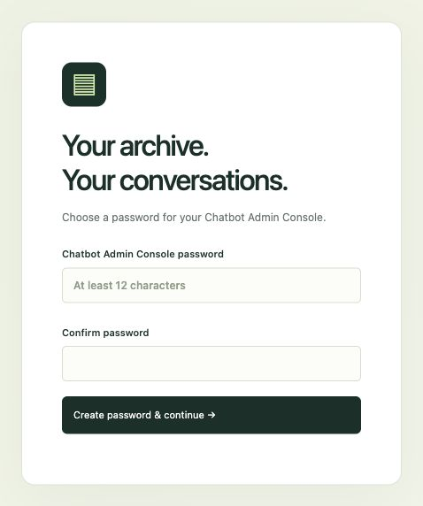</a>

<a href="screenshots/console-cabbage-connections.jpg">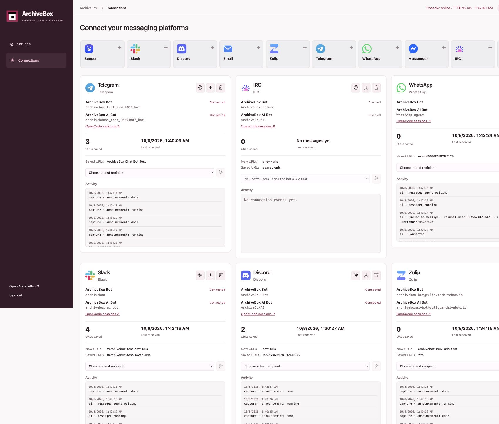</a>
<a href="screenshots/console-cabbage-settings.jpg">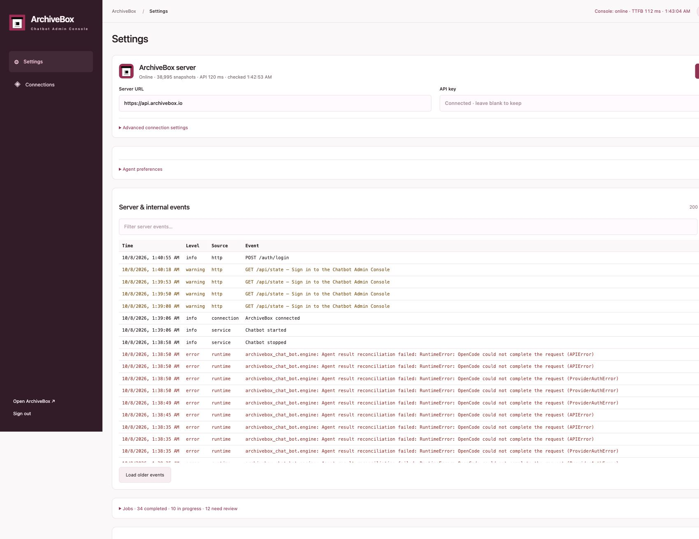</a>

- **Reachable links:** [Tailscale](https://tailscale.com/kb/1153/enabling-https) for personal use; a domain + HTTPS for internet access.
- **Localhost / 127.0.0.1:** allowed with a warning; set **Public URL** so links work on other devices.

</details>

### Providers

---


#### Slack

- **Connect:** choose **Create Slack app** in the Chatbot Admin Console → install the preconfigured app → follow the two screenshot guides to paste your **Bot token** (`xoxb-…`) and **App token** (`xapp-…`) → **Save & connect**.
- **Use:** invite the bot to channels; mention it in a thread or send a DM.
- **Destinations:** **Save & connect** creates **New URLs + Saved URLs** automatically. Socket Mode needs no public webhook.

<table>
<tr><th width="33%">1 · Set up the Slack app</th><th width="33%">2 · Configure the bot</th><th width="33%">3 · Mention in a thread</th></tr>
<tr>
<td width="33%" valign="top"><a href="screenshots/slack-setup.jpg"></a></td>
<td width="33%" valign="top"><a href="screenshots/console-cabbage-slack-capture.jpg">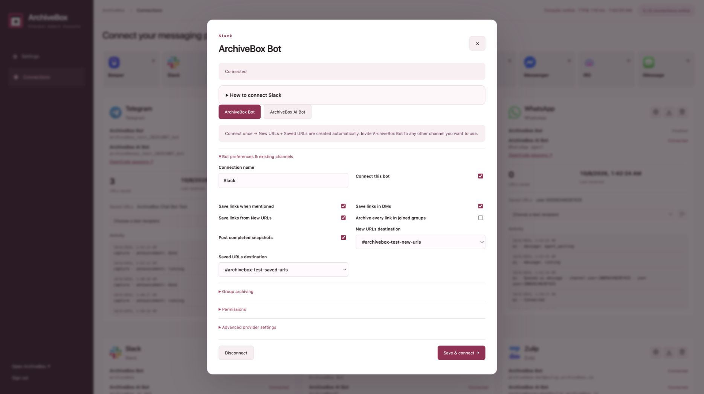</a></td>
<td width="33%" valign="top"><a href="screenshots/slack-thread.jpg">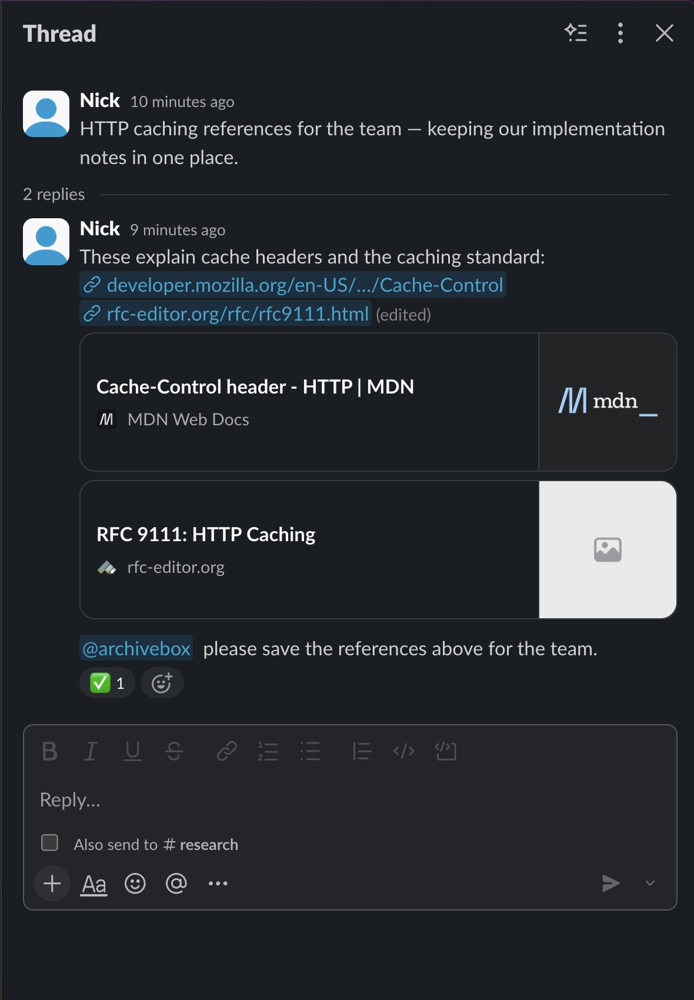</a></td>
</tr>
</table>

<table>
<tr><th width="50%">Or send a DM</th><th width="50%">Browse Saved URLs</th></tr>
<tr>
<td width="50%" valign="top"><a href="screenshots/slack-dm.jpg">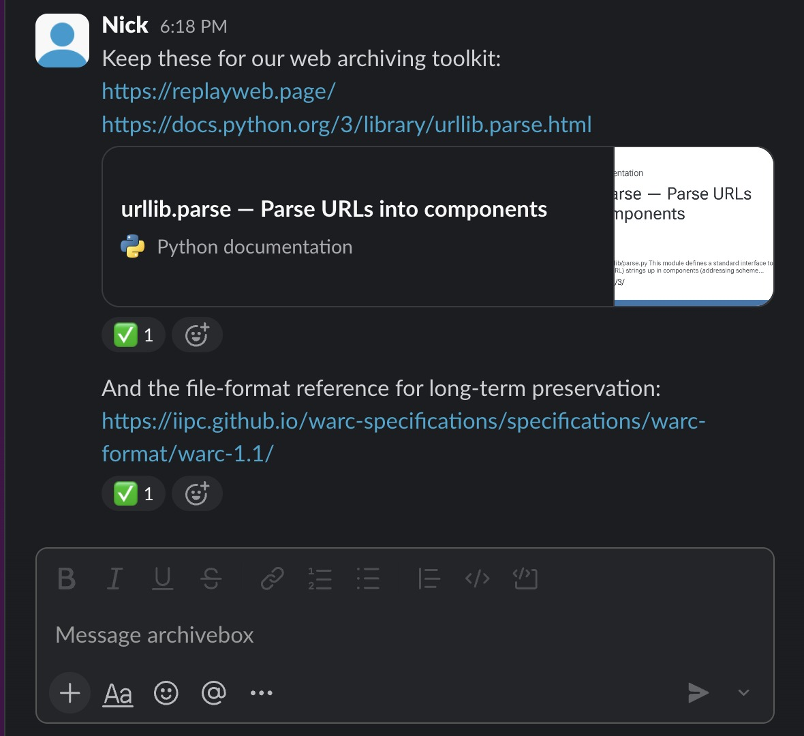</a></td>
<td width="50%" valign="top"><a href="screenshots/slack-saved.jpg">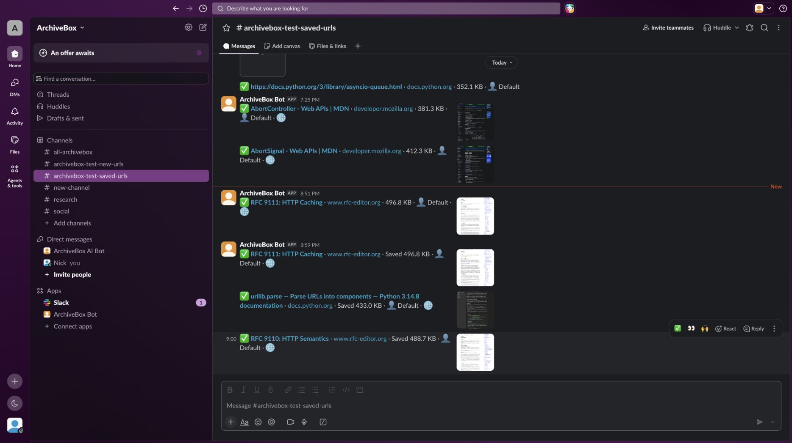</a></td>
</tr>
</table>

<details>
<summary><b>Where to get Slack tokens</b></summary>

<table>
<tr><th width="50%">Create the preconfigured app</th><th width="50%">Allow it in your workspace</th></tr>
<tr>
<td width="50%" valign="top"><a href="archivebox_chat_bot/static/guides/slack-create-app.jpg">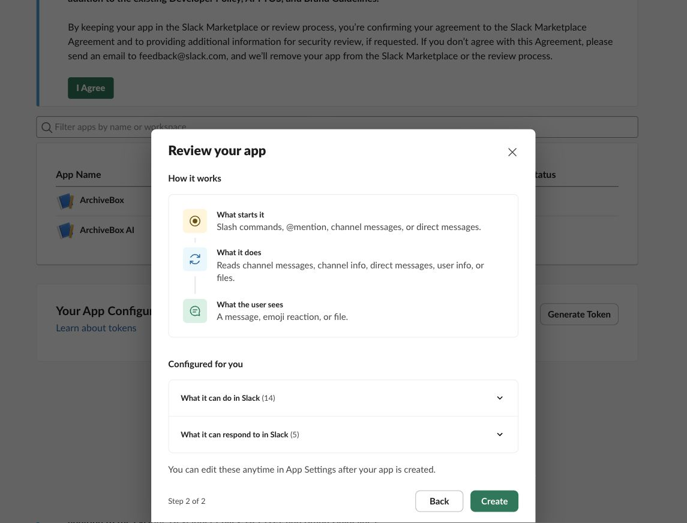</a></td>
<td width="50%" valign="top"><a href="archivebox_chat_bot/static/guides/slack-install-workspace.png">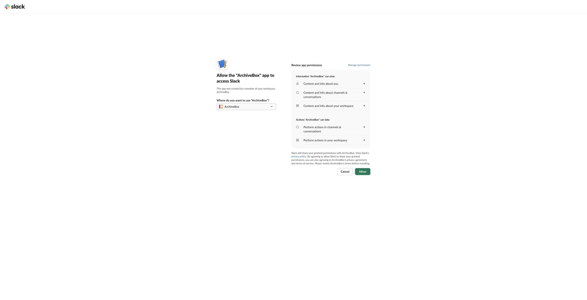</a></td>
</tr>
</table>

- Install the app: [Slack app setup](https://docs.slack.dev/tools/bolt-js/creating-an-app/).
- Copy the bot token: [Slack token types](https://docs.slack.dev/authentication/tokens/).
- Generate the app token: [Socket Mode setup](https://docs.slack.dev/tools/python-slack-sdk/socket-mode/).

<a href="archivebox_chat_bot/static/guides/slack-app-token-setup.jpg">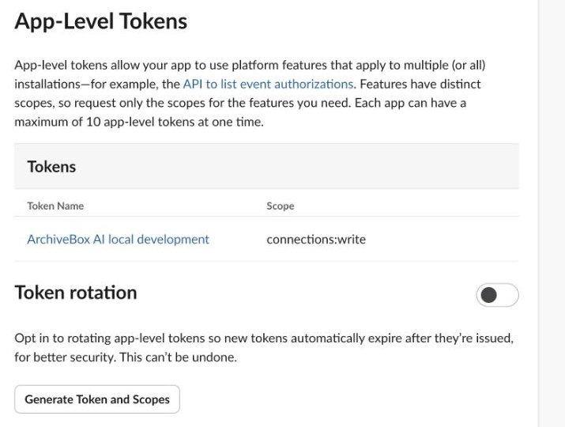</a>

</details>

---


#### Discord

- **Connect:** [create an app](https://discord.com/developers/applications) → **Bot → Reset Token** → paste token into the Chatbot Admin Console.
- **Enable:** **Bot → Message Content Intent → Save Changes** → **Find my bot → Add to Discord** → select your server → **Save & connect**.
- **Use:** DM links, mention the bot in channels/threads, or use `/archivebox save`, `search`, `auto`, `status`, `help`.
- **Destinations:** **New URLs + Saved URLs** are created automatically; choose existing channels under bot preferences. No public webhook.

<table>
<tr><th width="33%">1 · Get your bot token</th><th width="33%">2 · Enable Message Content</th><th width="33%">3 · Add to your server</th></tr>
<tr>
<td width="33%" valign="top"><a href="archivebox_chat_bot/static/guides/discord-bot-token.jpg">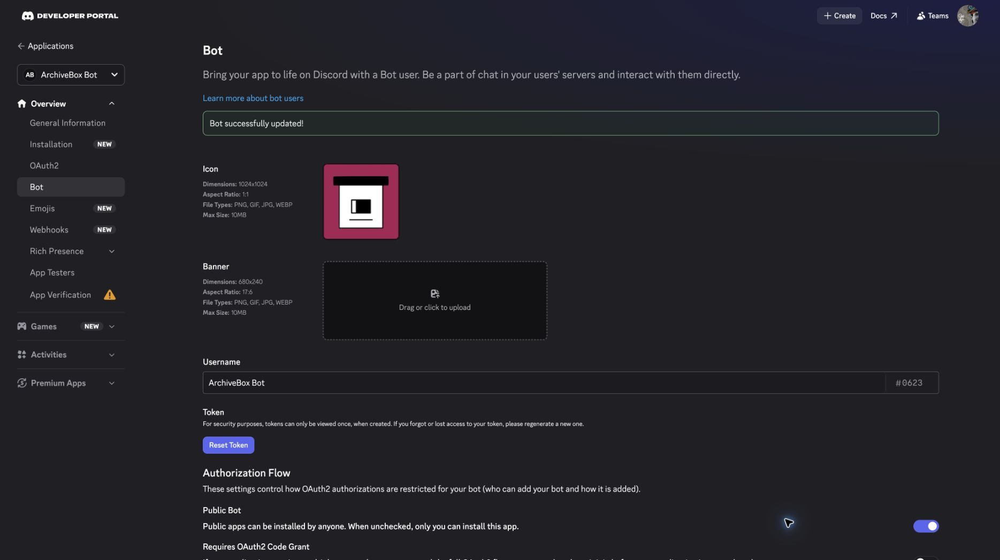</a></td>
<td width="33%" valign="top"><a href="archivebox_chat_bot/static/guides/discord-message-content.jpg">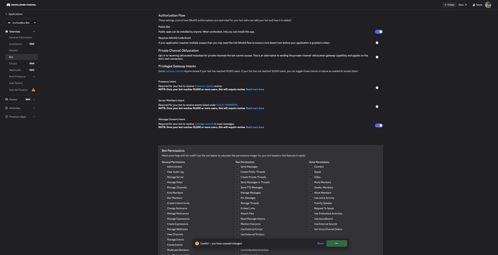</a></td>
<td width="33%" valign="top"><a href="archivebox_chat_bot/static/guides/discord-install.jpg">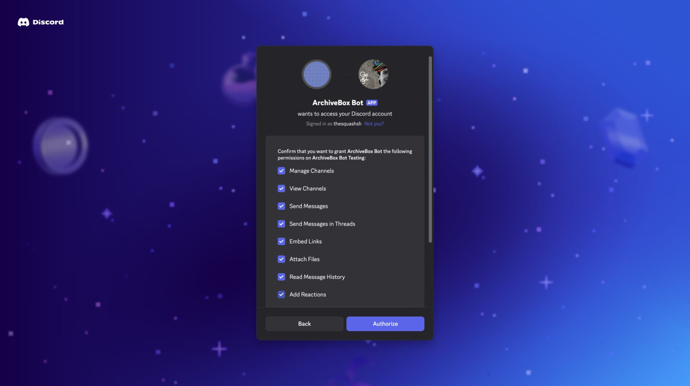</a></td>
</tr>
</table>

<details>
<summary><b>Create the app · install both bots</b></summary>

<a href="archivebox_chat_bot/static/guides/discord-create-app.jpg">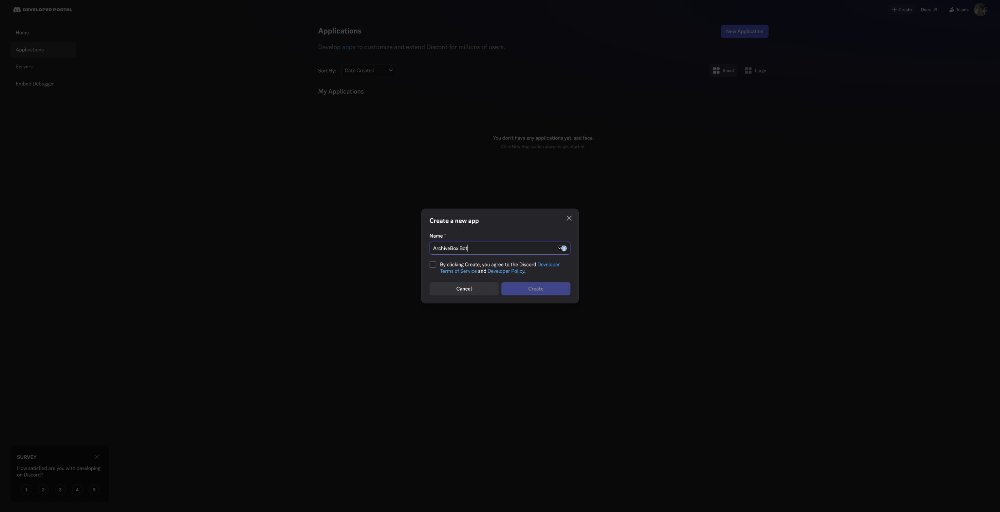</a>
<a href="archivebox_chat_bot/static/guides/discord-test-server.jpg">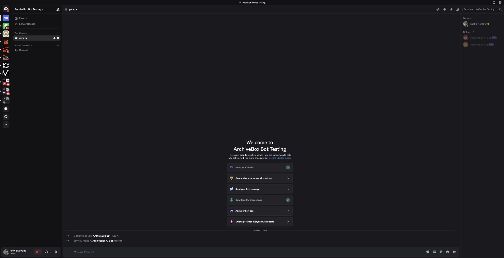</a>

</details>

[Official setup](https://docs.discord.com/developers/quick-start/getting-started) · [Message Content Intent](https://support-dev.discord.com/hc/en-us/articles/6207308062871-What-are-Privileged-Intents)

<table>
<tr><th width="50%">4 · Choose channels & preferences</th><th width="50%">5 · Browse Saved URLs</th></tr>
<tr>
<td width="50%" valign="top"><a href="screenshots/discord-capture-connected.jpg">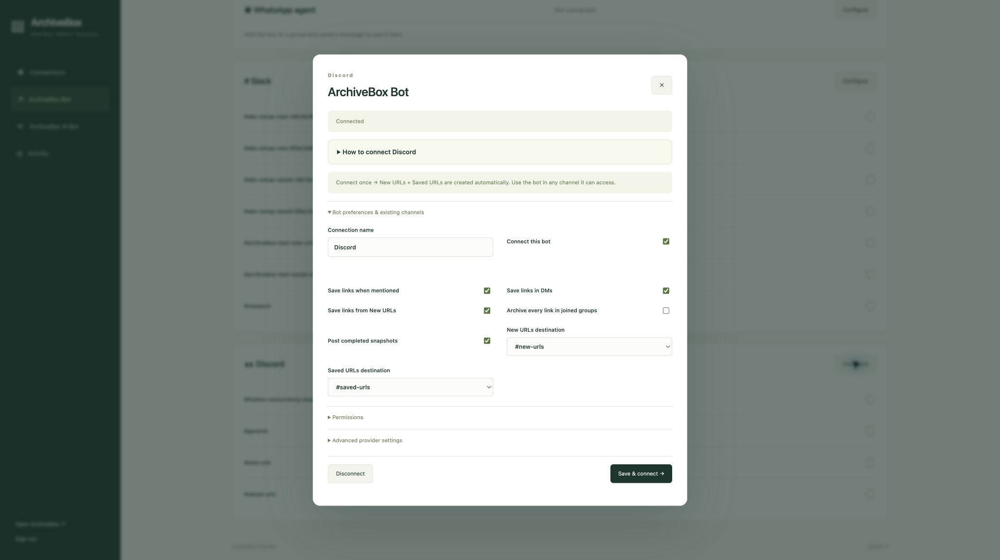</a></td>
<td width="50%" valign="top"><a href="screenshots/discord-capture-saved.jpg">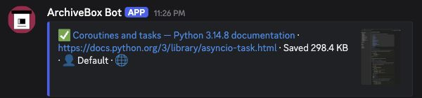</a></td>
</tr>
</table>

<p><strong>Live Cabbage check (2026-10-08):</strong> A channel mention, capture-bot DM, and AI DM were handled. All tested Ars Technica URLs resolve to snapshots whose captured response is <code>403 Forbidden</code>; replay shows that error instead of article content.</p>

<table>
<tr><th width="25%">Capture-bot channel mention</th><th width="25%">Capture-bot DM</th><th width="25%">Saved URL cards</th><th width="25%">AI DM reply</th></tr>
<tr>
<td width="25%" valign="top"><a href="screenshots/discord-new-urls-cabbage.jpg">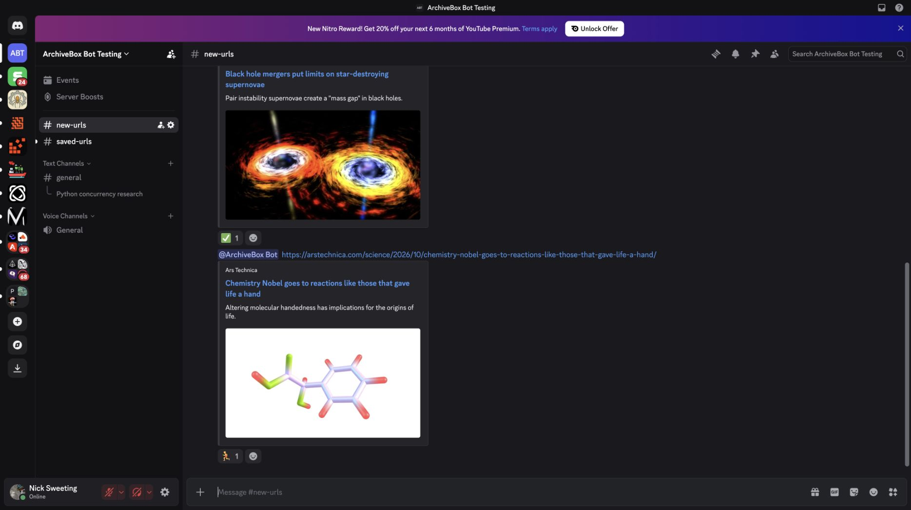</a></td>
<td width="25%" valign="top"><a href="screenshots/discord-bot-dm-capture-cabbage.jpg">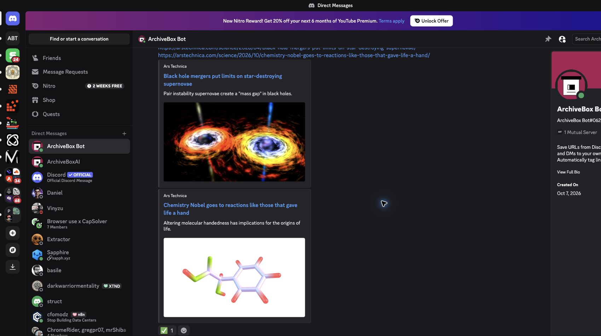</a></td>
<td width="25%" valign="top"><a href="screenshots/discord-saved-urls-cabbage.jpg">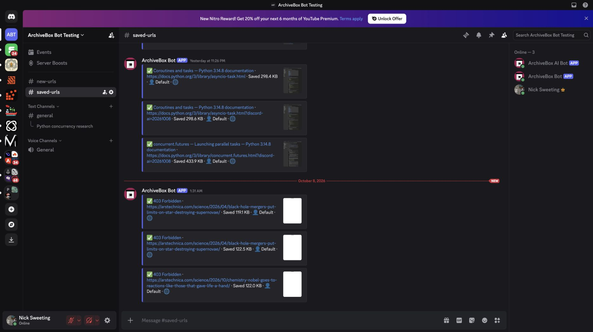</a></td>
<td width="25%" valign="top"><a href="screenshots/discord-ai-dm-response-cabbage.jpg">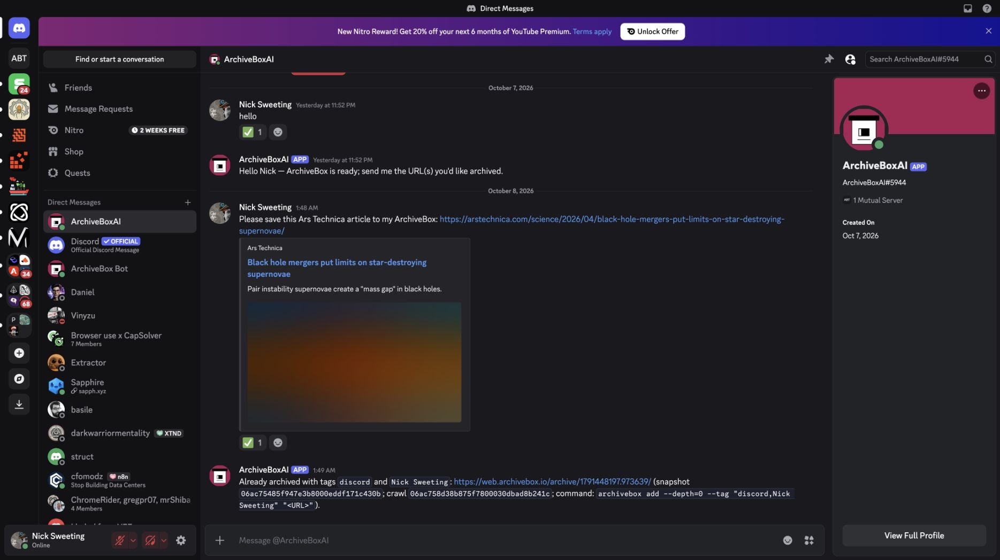</a></td>
</tr>
</table>

---


#### Zulip

- **Connect:** [create a Generic bot](https://zulip.com/help/add-a-bot-or-integration) → [copy bot email + API key](https://zulip.com/api/api-keys) → enter your server URL.
- **Use:** topics, mentions, DMs; create private **New URLs + Saved URLs** channels.

<table>
<tr><th width="33%">1 · Copy bot email</th><th width="33%">2 · Copy API key</th><th width="33%">3 · Browse Saved URLs</th></tr>
<tr>
<td width="33%" valign="top"><a href="archivebox_chat_bot/static/guides/zulip-bot-email.jpg">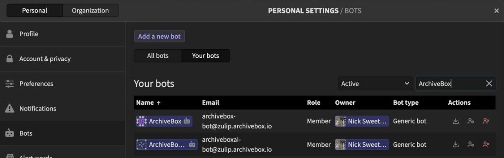</a></td>
<td width="33%" valign="top"><a href="archivebox_chat_bot/static/guides/zulip-bot-credentials.jpg">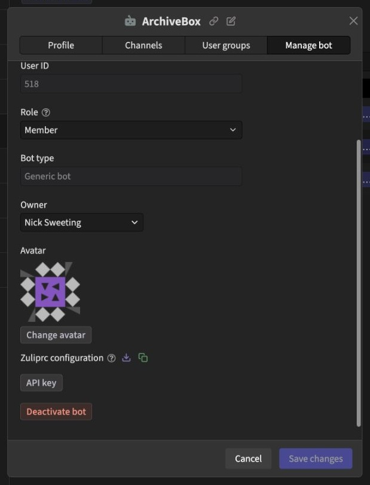</a></td>
<td width="33%" valign="top"><a href="screenshots/zulip.jpg">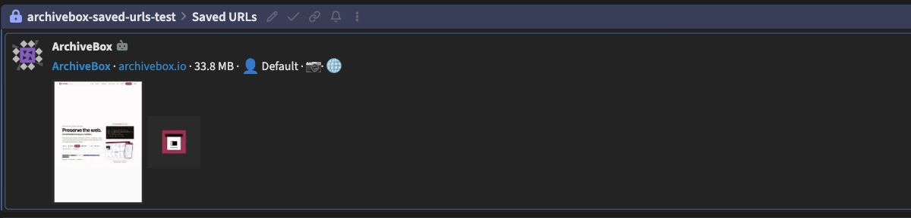</a></td>
</tr>
</table>

<p><strong>Live Cabbage check (2026-10-08):</strong> The stream mention and AI DM flows were handled, but both Ars Technica URLs already had snapshots showing <code>403 Forbidden</code>. The AI reply reported that <code>ONLY_NEW</code> skipped a retry, so these results do not show captured article content.</p>

<table>
<tr><th width="33%">Capture-bot stream mention</th><th width="33%">Saved URL results</th><th width="33%">AI DM reply</th></tr>
<tr>
<td width="33%" valign="top"><a href="screenshots/zulip-mention-cabbage.jpg">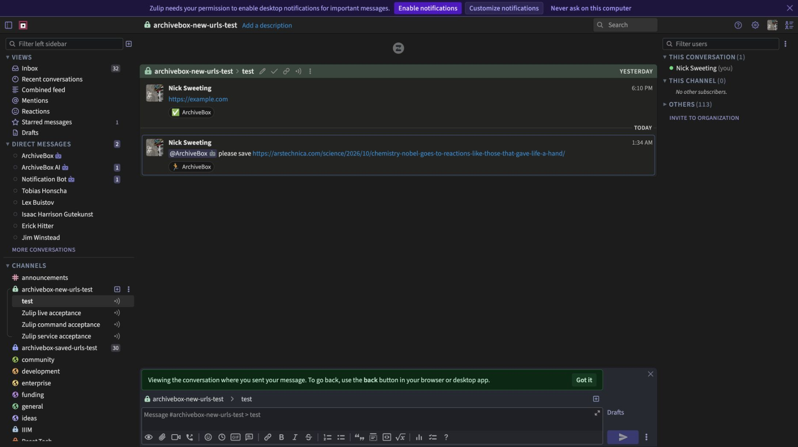</a></td>
<td width="33%" valign="top"><a href="screenshots/zulip-saved-urls-cabbage.jpg">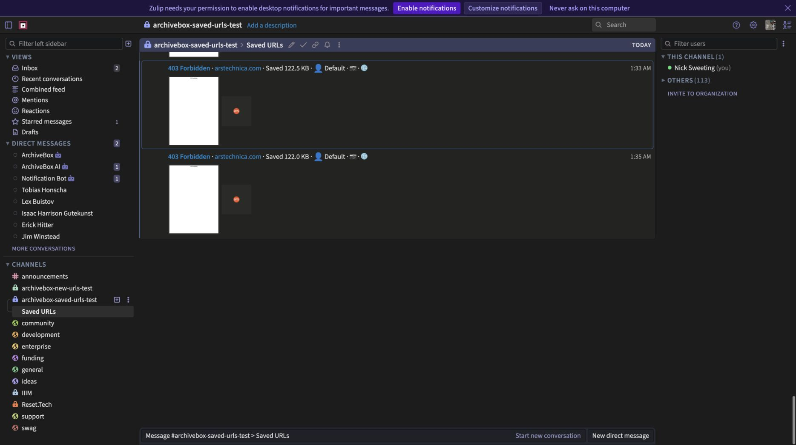</a></td>
<td width="33%" valign="top"><a href="screenshots/zulip-ai-dm-response-cabbage.jpg">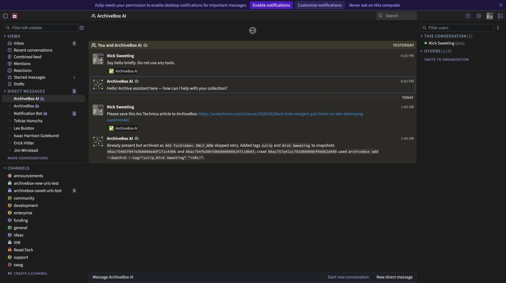</a></td>
</tr>
</table>

---


#### Telegram

- **Connect:** [BotFather → /newbot](https://core.telegram.org/bots/tutorial#obtain-your-bot-token) → copy token → add to group.
- **Groups:** [disable bot privacy](https://core.telegram.org/bots/features#privacy-mode), then remove/re-add the bot for group-wide capture.
- **Commands:** `/save`, `/search`, `/auto`, `/status`, `/help`; polling needs no public webhook.

<table>
<tr><th width="33%">1 · Add to your group</th><th width="33%">2 · Choose bot preferences</th><th width="33%">3 · Save references</th></tr>
<tr>
<td width="33%" valign="top"><a href="screenshots/telegram-group-config.jpg">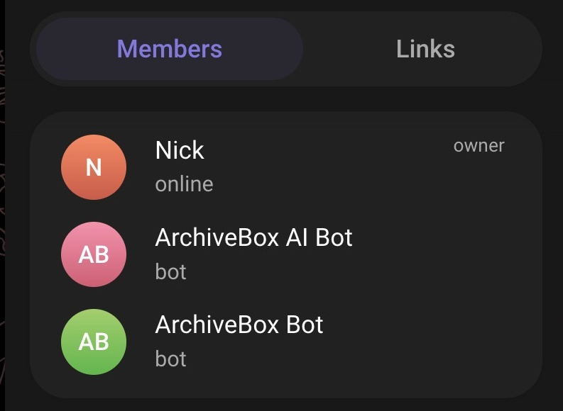</a></td>
<td width="33%" valign="top"><a href="screenshots/console-cabbage-telegram-capture.jpg">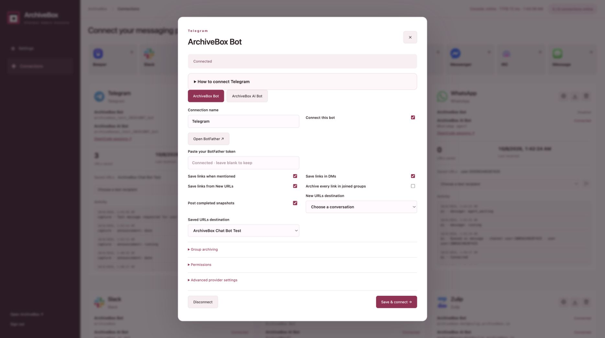</a></td>
<td width="33%" valign="top"><a href="screenshots/telegram-capture.jpg">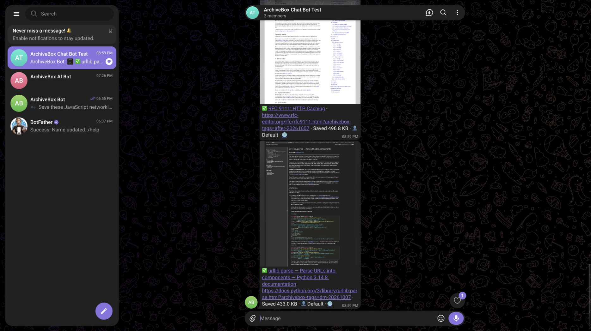</a></td>
</tr>
</table>

<details>
<summary><b>BotFather · names & group privacy</b></summary>

<a href="archivebox_chat_bot/static/guides/telegram-botfather-name.jpg">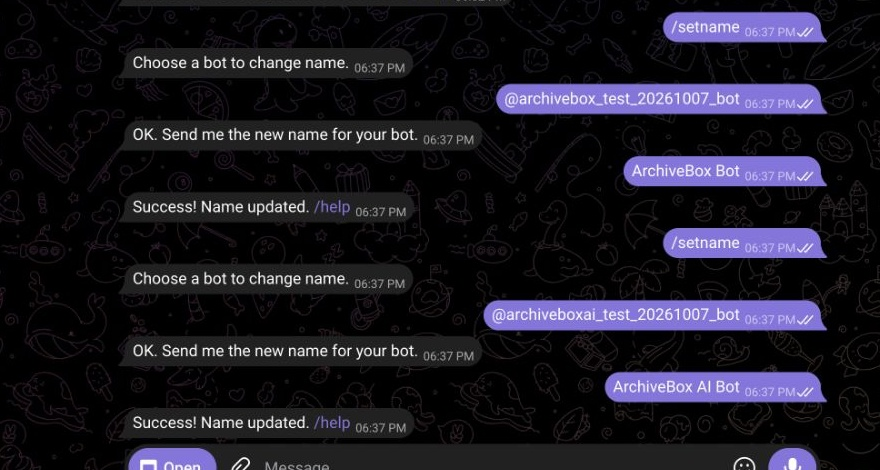</a>

<a href="archivebox_chat_bot/static/guides/telegram-botfather-capture-privacy.jpg">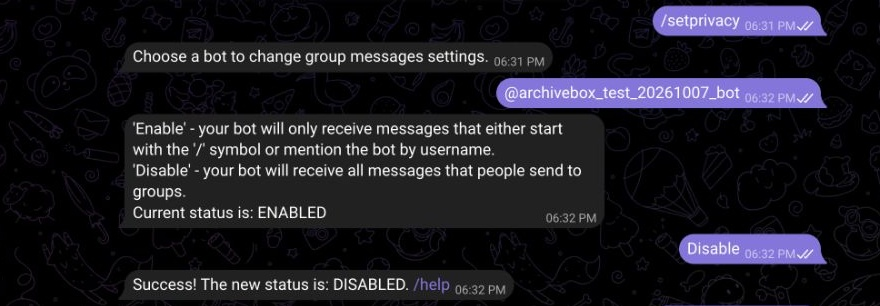</a>

</details>

---


#### WhatsApp

- **Connect:** [Settings → Agents → Create an agent → View API key](https://www.whatsapp.com/developer/WhatsApp-Agent-Platform-Developer-Manual.pdf#page=3) on your primary phone.
- **Groups:** choose QR pairing → [Linked Devices → Link a Device](https://faq.whatsapp.com/1317564962315842). [Agent keys](https://faq.whatsapp.com/1050934623978152) support creator DMs only.

<a href="screenshots/whatsapp-capture.jpg">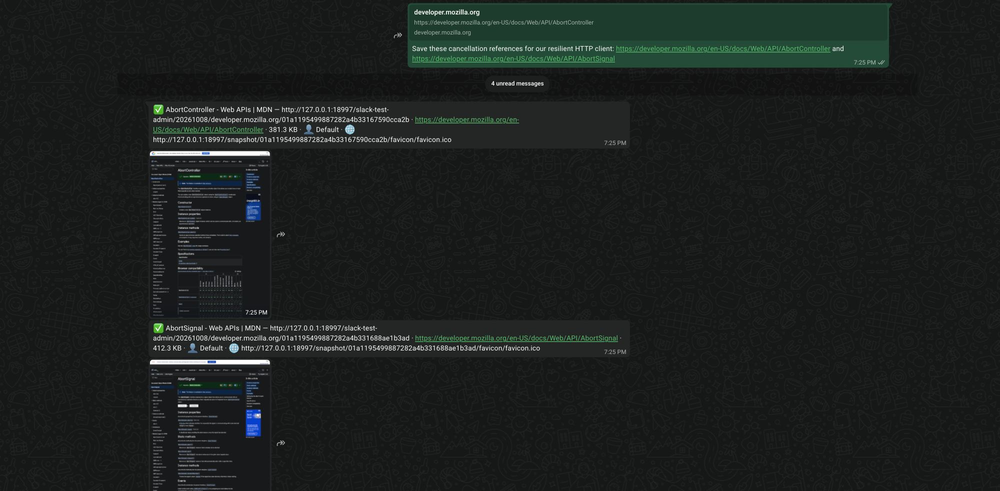</a>

<p><strong>Live Cabbage check (2026-10-08):</strong> A real WhatsApp Agent DM used <code>/archivebox save</code> with two Ars Technica URLs. The DM confirmed the request, and the Cabbage console recorded two saved URLs and a completed message. Both snapshots contain Ars Technica's HTTP <code>403 Forbidden</code> response, not article content.</p>

<table>
<tr><th width="50%">Real WhatsApp DM</th><th width="50%">Cabbage saved result</th></tr>
<tr>
<td width="50%" valign="top"><a href="screenshots/whatsapp-e2e-cabbage.jpg">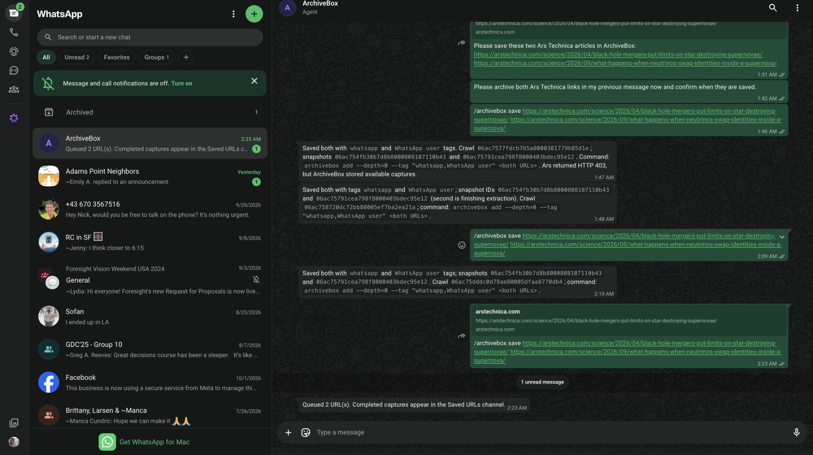</a></td>
<td width="50%" valign="top"><a href="screenshots/whatsapp-saved-cabbage.jpg">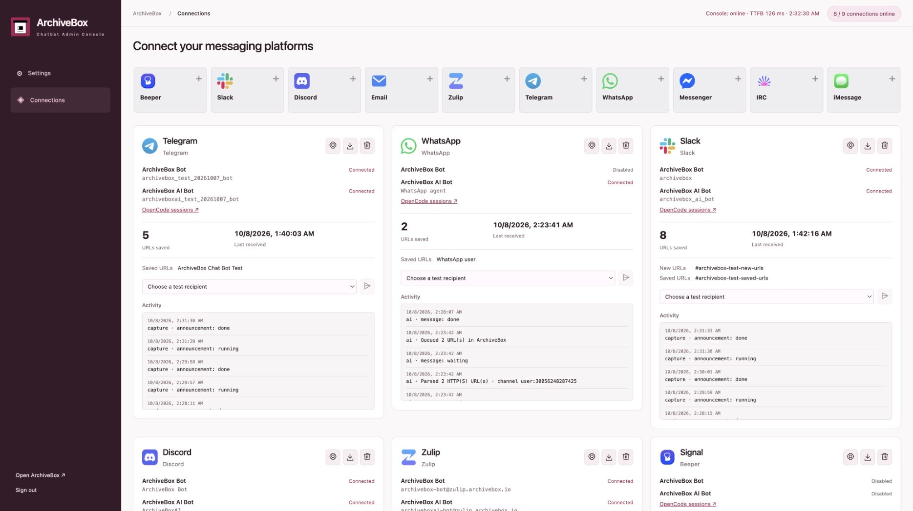</a></td>
</tr>
</table>

---


#### IRC

- **Connect:** [server + nickname + channels](https://libera.chat/guides/connect) → [register an account](https://libera.chat/guides/registration) → [SASL](https://libera.chat/guides/sasl).
- **Use:** mentions, private messages, auto-archive channels; saved cards use text links.

<table>
<tr><th width="50%">1 · Configure the bot</th><th width="50%">2 · Browse Saved URLs</th></tr>
<tr>
<td width="50%" valign="top"><a href="screenshots/irc-config.png">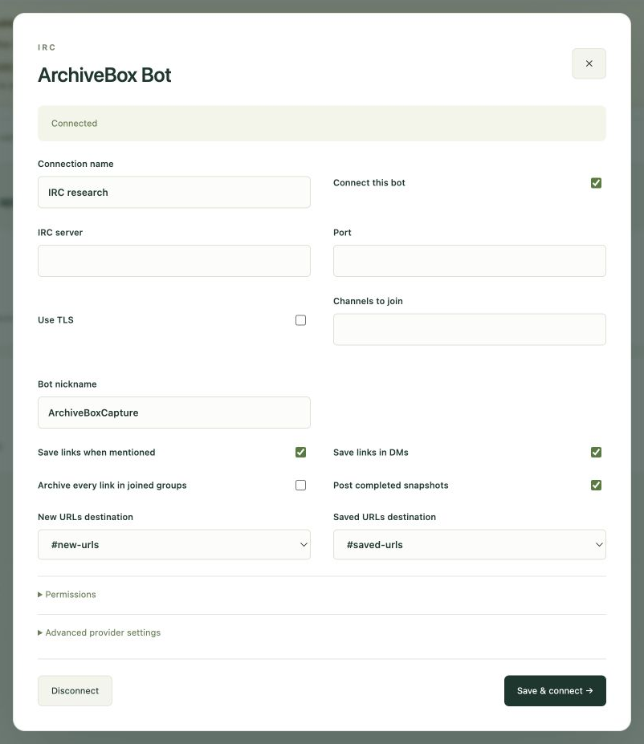</a></td>
<td width="50%" valign="top"><a href="screenshots/irc-capture.png">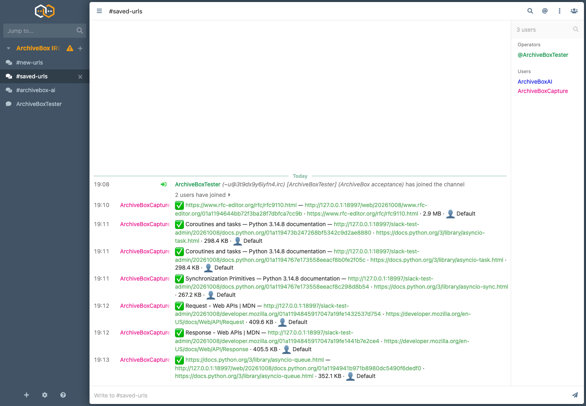</a></td>
</tr>
</table>

<p><strong>Live Cabbage check (2026-10-08):</strong> In the signed-in Lounge UI, <code>ArchiveBoxTester</code> mentioned <code>ArchiveBoxCapture</code> in <code>#new-urls</code> and sent two Ars Technica URLs in a capture-bot DM. Both captures completed, and the saved channel shows three result cards: April channel snapshot <code>06ac7719f3997373800022139b4a76f3</code>, plus the April and October DM snapshots <code>06ac76f04b0473098000a102ed4bd265</code> and <code>06ac76f04b047f6780006432632c6c0f</code>. Each result is titled <code>403 Forbidden</code>; the snapshots contain the origin's error response, not article content. The IRC AI bot was configured through the console at <code>ergo:6667</code> (plain IRC, no TLS), after its old <code>127.0.0.1:16667</code> endpoint failed. Its request created snapshots <code>06ac76358bae7ed78000c4cfe72049be</code> and <code>06ac76358baf7cb88000cdb323aa1f0e</code>, also HTTP <code>403</code>. The AI used the normal CLI's <code>--no-only-new</code> option because <code>ONLY_NEW</code> skipped URLs with existing snapshots. In the capture job records, <code>num_snapshots</code> remained <code>0</code> even though their results listed the snapshot IDs.</p>

<table>
<tr><th width="33%">Channel mention</th><th width="33%">Capture-bot DM</th><th width="34%">Saved snapshot result</th></tr>
<tr>
<td width="33%" valign="top"><a href="screenshots/irc-new-urls-cabbage.jpg">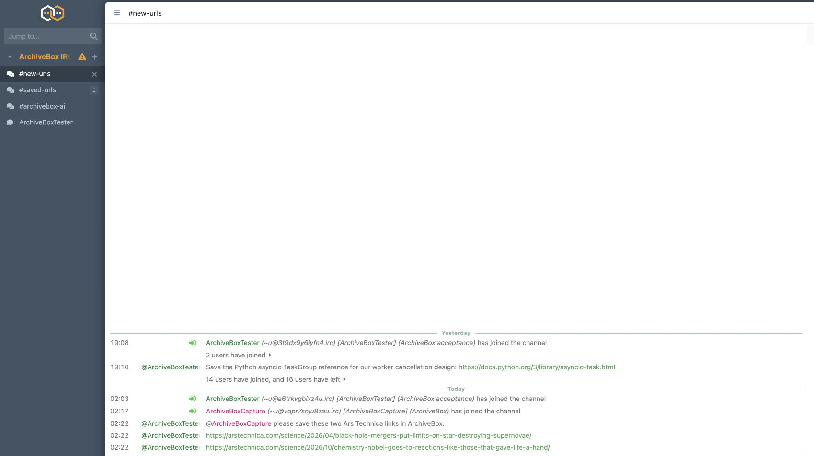</a></td>
<td width="33%" valign="top"><a href="screenshots/irc-capture-bot-dm-cabbage.jpg">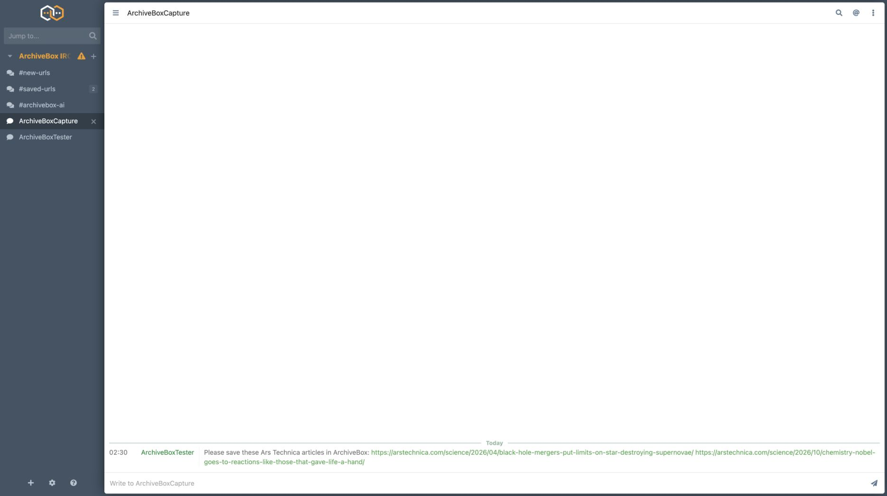</a></td>
<td width="34%" valign="top"><a href="screenshots/irc-saved-urls-cabbage.jpg">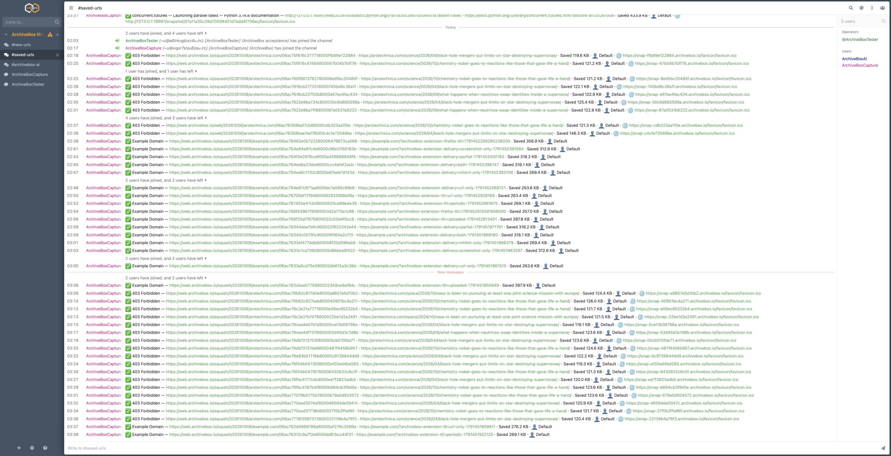</a></td>
</tr>
</table>

---


#### iMessage

- **Connect:** [install imsg](https://github.com/openclaw/imsg/blob/main/docs/install.md) on a Mac → [Full Disk Access + Messages Automation](https://github.com/openclaw/imsg/blob/main/docs/permissions.md).
- **Use:** existing conversations; local Mac or Docker → SSH.

<table>
<tr><th width="50%">1 · Enable Full Disk Access</th><th width="50%">2 · Allow Messages Automation</th></tr>
<tr>
<td width="50%" valign="top"><a href="archivebox_chat_bot/static/guides/imessage-permissions-setup.jpg">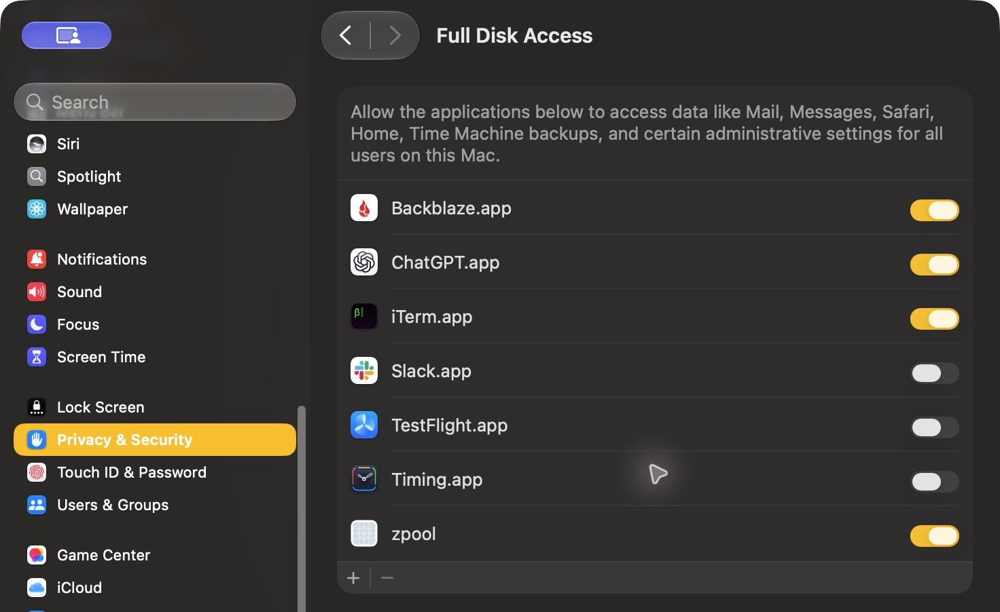</a></td>
<td width="50%" valign="top"><a href="archivebox_chat_bot/static/guides/imessage-automation-setup.jpg">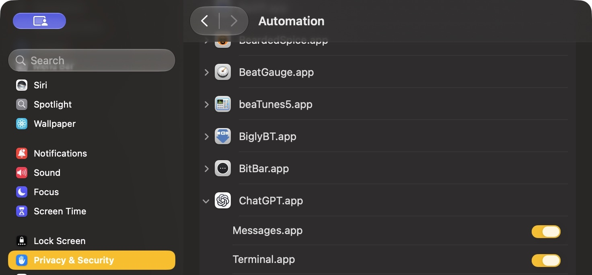</a></td>
</tr>
</table>

<details>
<summary><b>Docker → Mac prerequisites</b></summary>

- SSH key + verified `known_hosts`, readable by container UID **1000**.
- Set the Mac's absolute `imsg` path; Compose does not provision the Mac or SSH access.

</details>

---


#### Messenger

- **Connect:** [Meta app + Page token](https://developers.facebook.com/docs/messenger-platform/get-started) → [HTTPS webhook](https://developers.facebook.com/docs/messenger-platform/webhooks); or an existing [Matrix bridge](https://github.com/mautrix/meta).
- **Use:** Page conversations; personal groups through Matrix.

<table>
<tr><th width="50%">1 · Create a Page</th><th width="50%">2 · Generate token & configure webhook</th></tr>
<tr>
<td width="50%" valign="top"><a href="archivebox_chat_bot/static/guides/messenger-setup.jpg"></a></td>
<td width="50%" valign="top"><a href="archivebox_chat_bot/static/guides/messenger-token-setup.jpg">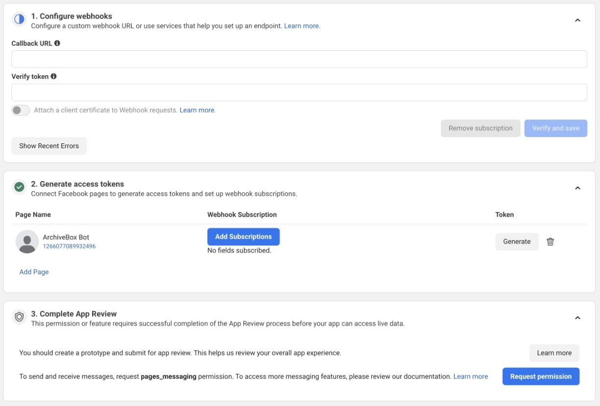</a></td>
</tr>
</table>

<details>
<summary><b>Meta webhook</b></summary>

- Register `https://<chatbot-host>/connections/<connection-id>/capture/webhook` with your matching verify token.
- Subscribe the Page to message events; use `/ai/webhook` for ArchiveBox AI Bot.

</details>

<p><strong>Live Cabbage check (2026-10-08):</strong> A real Facebook Messenger Page conversation sent two Ars Technica URLs to the connected ArchiveBox Bot Page. The webhook returned HTTP <code>200</code>, and Cabbage recorded two saved URLs and a completed capture. Ars Technica returned HTTP <code>403 Forbidden</code> for both snapshots, so they contain the error response rather than article content.</p>

<table>
<tr><th width="50%">Real Messenger conversation</th><th width="50%">Cabbage saved result</th></tr>
<tr>
<td width="50%" valign="top"><a href="screenshots/messenger-e2e-cabbage.jpg">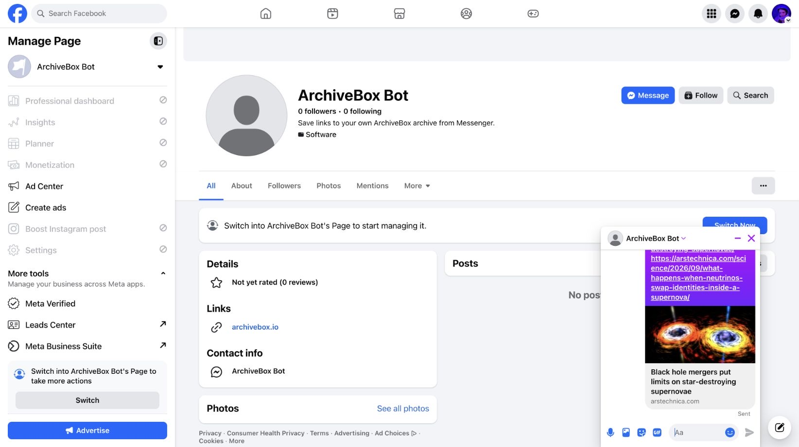</a></td>
<td width="50%" valign="top"><a href="screenshots/messenger-saved-cabbage.jpg">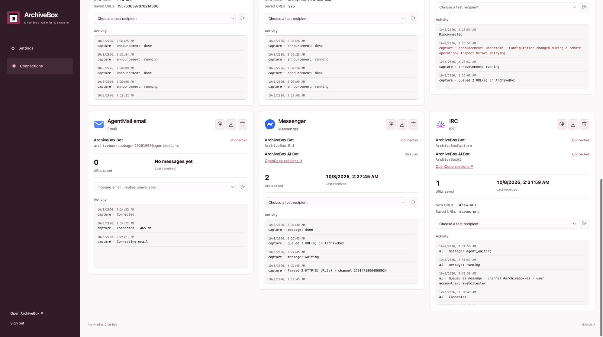</a></td>
</tr>
</table>

---


#### Beeper

- **Connect networks once:** [Beeper Desktop/Server](https://github.com/beeper/cli#2-local-beeper-server-self-hosted-managed-by-the-cli) → URL + API token → **Find my accounts**.
- **Token:** [Settings → Integrations → Approved connections → +](https://developers.beeper.com/desktop-api/auth/); allow sending. [Enable remote access](https://developers.beeper.com/desktop-api/advanced/remote-access/) for Docker.
- **Personal account:** enable **Archive my own messages** for capture in selected chats, including Signal Note to Self. Bot replies are tracked separately so they are not captured again; this option does not enable AI replies to your own messages.

<p><strong>Live Signal check (2026-10-08):</strong> Real Signal Desktop messages in Note to Self and the dedicated ArchiveBox Cabbage Test group each queued two Ars Technica URLs through Beeper. These captures are still waiting in Cabbage's ArchiveBox queue. The group also receives Saved URLs notifications from the collection; those notifications are not proof that the pending Signal captures completed.</p>

<table>
<tr><th width="50%">Signal DM and queue acknowledgement</th><th width="50%">Signal group submission</th></tr>
<tr>
<td width="50%" valign="top"><a href="screenshots/signal-dm-queued-cabbage.png">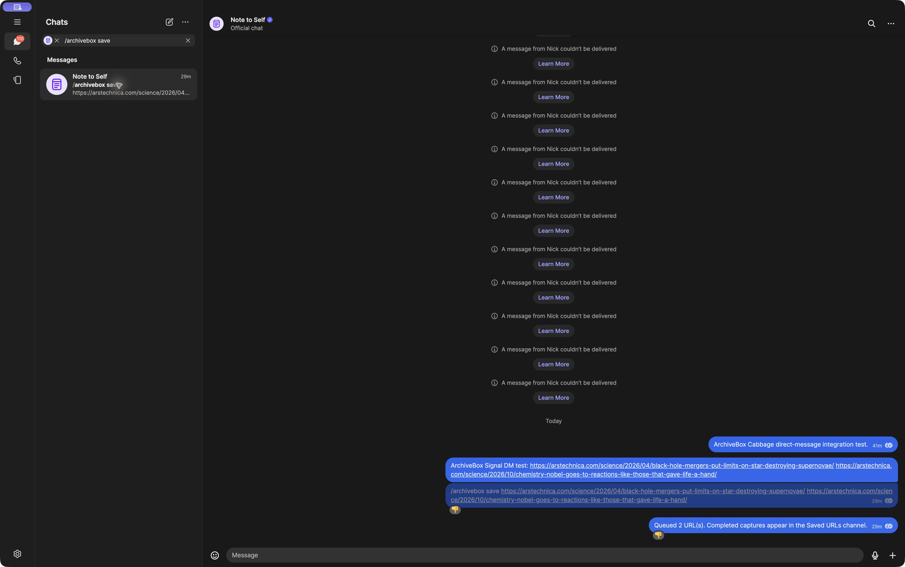</a></td>
<td width="50%" valign="top"><a href="screenshots/signal-group-request-cabbage.png">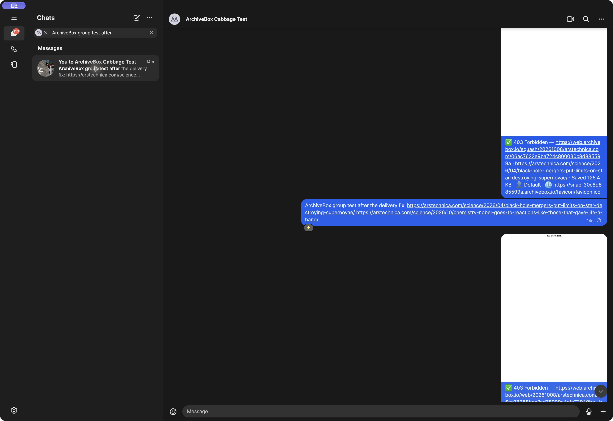</a></td>
</tr>
</table>

<details>
<summary><b>Docker → Beeper address</b></summary>

- Use the Beeper server's reachable network address; container `localhost` points at the bot itself. Beeper runs separately; iMessage needs a Mac.

</details>

---

#### ✉️ Email

- **Connect:** dedicated mailbox → IMAP server + address + app password → **Save & connect**. [AgentMail](https://docs.agentmail.to/agent-onboarding) can create an unclaimed, receive-only inbox; use `imap.agentmail.to`, port `993`, TLS, the inbox address, and its API key as the password.
- **Send / forward / CC** → save links from the subject, body, quoted conversation, and text/HTML/`.eml` attachments.
- **Tags:** `email` + sender's name · **Results:** ArchiveBox + **Activity**.
- **Inbox:** checked every 30 seconds; new mail only by default. Optional first-connection import of existing mail.
- **Inbound only:** no SMTP or replies; preserves read/unread flags. PDF, Office, and image attachments are not inspected or uploaded.

<p><strong>Live Gmail → AgentMail check (2026-10-08):</strong> Two real Gmail messages with two Ars Technica URLs each were read from AgentMail over IMAP, parsed, and saved by Cabbage. The UID 3 and UID 4 jobs completed with four sealed ArchiveBox snapshots and non-empty saved outputs, including WACZ, screenshot, and hash-manifest files. Ars Technica returned <code>403 Forbidden</code> for these requests, so the captures do not contain the article bodies.</p>

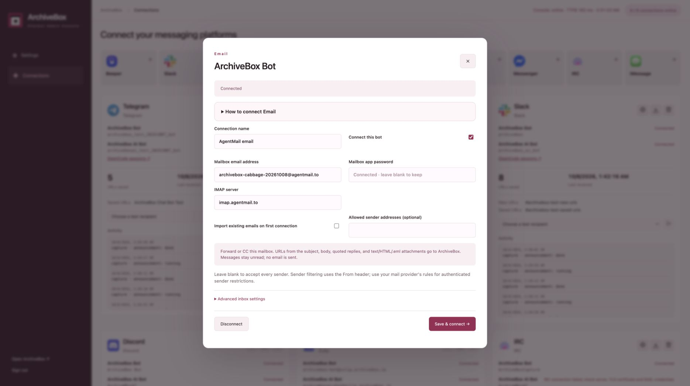


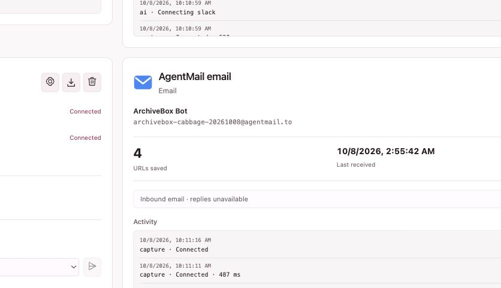

[Google app passwords](https://support.google.com/accounts/answer/185833) · [Gmail IMAP](https://support.google.com/mail/answer/7126229) · [iCloud IMAP](https://support.apple.com/en-us/102525) · [Fastmail IMAP](https://www.fastmail.help/hc/en-us/articles/1500000278342-Server-names-and-ports)

---

### Groups & commands

- Invite the bot → send a message → select the group in the Chatbot Admin Console.
- Enable **Archive every link** per group or across joined groups; choose administrators under **Permissions**.

| Command | Action |
|---|---|
| `/archivebox save <URLs>` | Capture links |
| `/archivebox search <words>` | Find saved pages |
| `/archivebox auto on` / `off` | Toggle this group's automatic capture |
| `/archivebox status` | Check ArchiveBox |
| `/archivebox help` | Show commands |

<details>
<summary><b>Capture & provider details</b></summary>

- Capture depth **0**, selected persona.
- History: provider API where available, otherwise messages received while connected.
- Zulip: commands in DMs or after a mention. IRC/iMessage: commands as ordinary message text.
- Reactions/media depend on the provider; IRC/iMessage lack reliably targeted reactions, Messenger Pages use text replies.

</details>

### Administration

<details>
<summary><b>Deployment & updates</b></summary>

- Include ArchiveBox: uncomment the `archivebox` service in [docker-compose.yml](docker-compose.yml), then run `docker compose up -d --build`.
- ArchiveBox inside Compose: `http://archivebox:5797`; for a separately hosted server, use its reachable URL.
- **Public URL** is the address readers open; split API/admin hosts are discovered automatically.
- Back up `./archivebox-chat-bot/`; run one bot service per data directory.
- Update: `git pull --ff-only && docker compose up -d --build`.

</details>

<details>
<summary><b>Credentials & recovery</b></summary>

- **Activity** → jobs, sessions, **Recover answer**, Chatbot Admin Console password.
- Queued jobs retain their original server/connection; review uncertain delivery before retrying.
- Blank credential fields preserve secrets. Protect the data directory; use HTTPS for remote access.
- Revoke credentials to remove access. Removing bot data preserves snapshots and chat messages.

</details>

<details>
<summary><b>Development</b></summary>

```bash
uv sync
cd connectors && npm ci && npm run build && cd ..
uv run archivebox-chat-bot
uv run python -m pytest -xq tests/local
uv run ruff check .
```

- Python: shared capture/agent engine, queue, permissions, Chatbot Admin Console.
- Transports: [Beeper API](https://developers.beeper.com/desktop-api/), [Chat SDK](https://chat-sdk.dev/docs), Slack/Zulip APIs, [discord.py](https://discordpy.readthedocs.io/), pydle, imsg.
- Live tests: `tests/test_*_live.py`. Chat and setup screenshots are our sessions. Provider logos are official website assets; IRC uses the Libera.Chat network logo, and the bundled Messenger logo comes from [Messenger](https://www.messenger.com/).

</details>

#### Terms of Service

Applies to **ArchiveBox Bot** and **ArchiveBox AI Bot**. Updated **2026-10-08**.

- **Self-hosted:** each deployment is run by its operator, who controls access, configuration, storage, and availability. Installing a Discord app does not provision an ArchiveBox server.
- **Authorized use:** archive only content you are entitled to access and preserve; respect applicable laws, content rights, and your chat provider's rules. Operators must inform participants when automatic capture is enabled.
- **Your responsibility:** protect credentials and backups, choose who can use the bots, and review AI actions and results. Captures and AI answers may be incomplete or incorrect.
- **License:** the software is provided under the [MIT License](LICENSE), including its warranty disclaimer and limitation of liability. No hosted service, uptime guarantee, or paid subscription is included.
- **Stop using it:** disconnect the bots and revoke their credentials. Existing archives, sessions, messages, and backups require separate deletion by their operators.
- **Help:** [project issues](https://github.com/ArchiveBox/archivebox-chat-bot/issues) · [ArchiveBox community](https://zulip.archivebox.io). For a particular deployment or data-removal request, contact the person or organization operating that bot.

#### Privacy Policy

Applies to **ArchiveBox Bot** and **ArchiveBox AI Bot**. Updated **2026-10-08**.

- **Data received:** message text, sender names/identifiers, conversation names/identifiers, and message/thread identifiers made available by the connected provider. Email capture also reads message subjects and supported attachment text.
- **Local storage:** the operator's data directory stores credentials, configuration, recent conversation history, and job requests/results/errors. Received messages can enter history even when capture permissions prevent archiving. Active history retains up to 200 messages per connection, bot, and conversation; jobs, disconnected-account data, and backups have no automatic expiry.
- **Capture:** extracted URLs and source tags (provider, sender, channel/group) go to the configured ArchiveBox server. That server contacts archived websites and any services enabled by its operator. Capture cards, screenshots, favicons, search results, and replies can be posted to the configured chat destinations and become visible to their members.
- **Optional AI:** trusted users' requests and conversation context go to the configured ArchiveBox/OpenCode service and its configured model providers and tools. These services have their own processing and retention policies. AI is disabled until configured and enabled.
- **Security:** the database uses restrictive filesystem permissions; stored credentials are not encrypted by the application. The Chatbot Admin Console password is hashed. Operational logs can contain errors and exceptions. Operators must protect the host, data directory, backups, and remote connections.
- **No built-in advertising or analytics:** the bot does not send usage analytics to ArchiveBox maintainers. Chat providers, hosting services, archived websites, and optional AI services process data under their own policies.
- **Access and deletion:** contact the deployment operator to request access, correction, or deletion of retained data and backups. Disconnecting/revoking credentials stops further access; deleting bot data does not delete ArchiveBox snapshots, OpenCode sessions, or messages already posted to chat. Those must be removed separately in their respective systems.
- **Questions:** contact the deployment operator first. Project support is available through [ArchiveBox community](https://zulip.archivebox.io) or [issues](https://github.com/ArchiveBox/archivebox-chat-bot/issues); do not post private messages or credentials in public support channels. Revisions to this policy appear here with an updated date.

<a id="archivebox-ai-bot"></a>

## 🧠 ArchiveBox AI Bot

- **DM / @mention** → capture, tag, organize, and verify.
- **Follow up** → include recent messages and previous replies.
- **ArchiveBox → Agent** → inspect each new session and tool results.
- **Existing OpenCode** → providers, credentials, tools, session database; tasks survive restarts.

### Connect the AI bot

1. **ArchiveBox AI Bot** in the Chatbot Admin Console → connect a second bot/account.
2. **Trusted people** → choose who can run tasks.
3. **Agent preferences** → optional prompt → enable.

### AI providers

---


#### Slack AI

- **Connect:** choose **Create Slack app** for ArchiveBox AI Bot → install the second preconfigured app → paste its **Bot token** and **App token** → **Save & connect**. Native agent status and Stop controls appear in Slack.
- **Shown:** plan → approval → capture HTTP caching references → tag and verify.

<table>
<tr><th width="50%">1 · Configure ArchiveBox AI Bot</th><th width="50%">2 · Complete an archive task</th></tr>
<tr>
<td width="50%" valign="top"><a href="screenshots/slack-ai-config.jpg">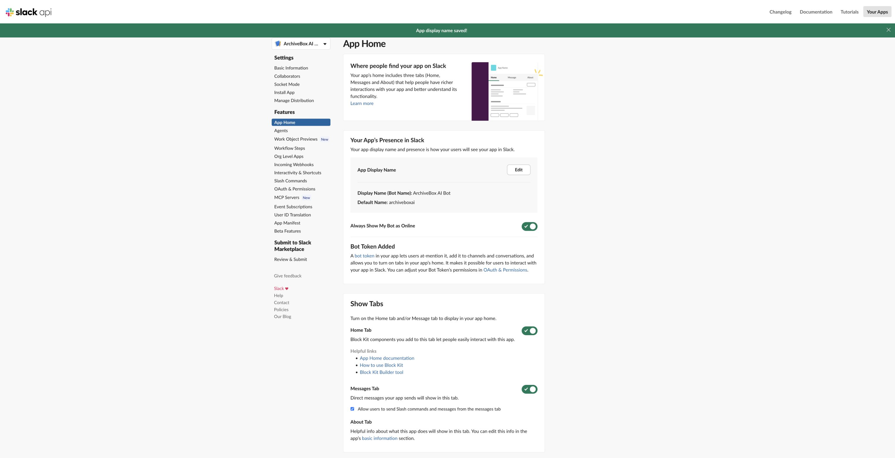</a></td>
<td width="50%" valign="top"><a href="screenshots/slack-ai-task.jpg">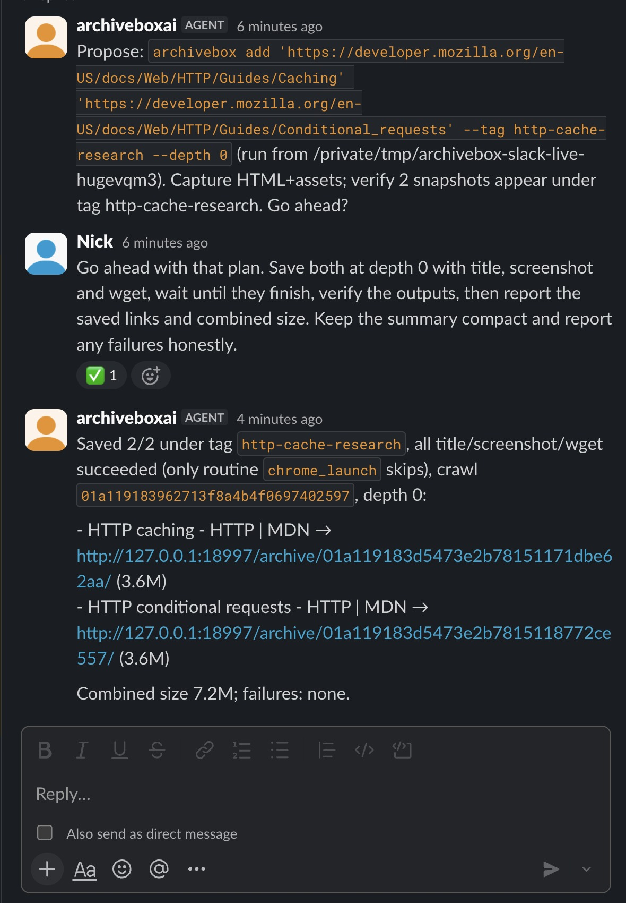</a></td>
</tr>
</table>

---


#### Discord AI

- **Connect:** create a second Discord app named **ArchiveBox AI Bot** → repeat the [Discord setup](#discord) → choose **Trusted people**.
- **DM / mention:** capture, tag, and verify with your existing ArchiveBox agent; follow up in the same DM or thread.
- **ArchiveBox → Agent:** open the session and its tool results.

<details>
<summary><b>Choose who can use ArchiveBox AI Bot</b></summary>

<a href="screenshots/discord-ai-connected.jpg">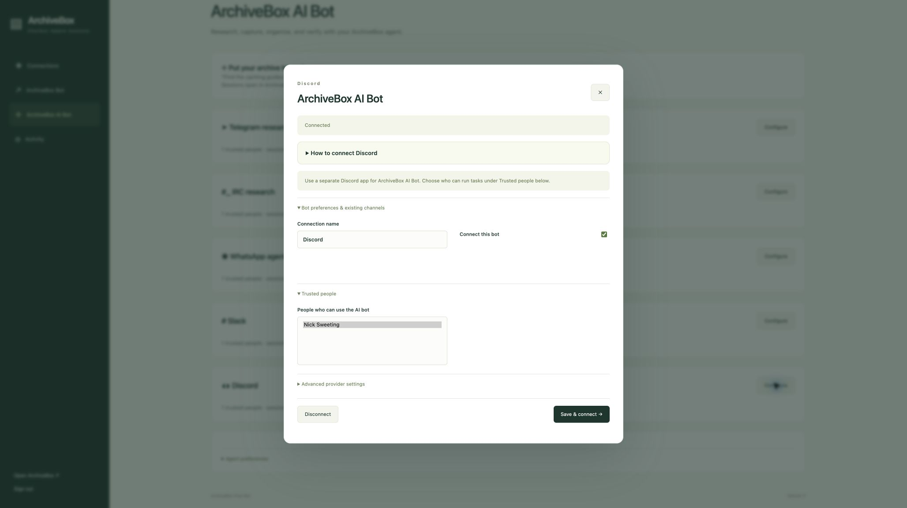</a>

</details>

<a href="screenshots/discord-ai-task.jpg">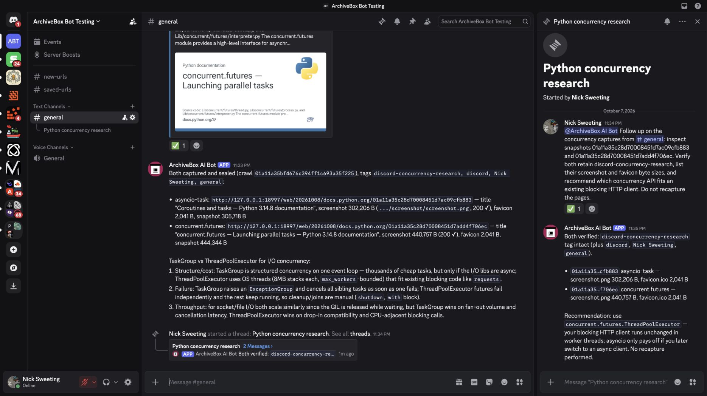</a>

---


#### Telegram AI

- **Connect:** second BotFather token; add ArchiveBox AI Bot to the group.
- **Shown:** a real Telegram DM asks the Cabbage server for its collection path and snapshot count; OpenCode runs the ArchiveBox command and replies in Telegram.

<table>
<tr><th width="50%">1 · Connect the AI bot</th><th width="50%">2 · Query the live collection</th></tr>
<tr>
<td width="50%" valign="top"><a href="screenshots/console-cabbage-telegram-ai.jpg">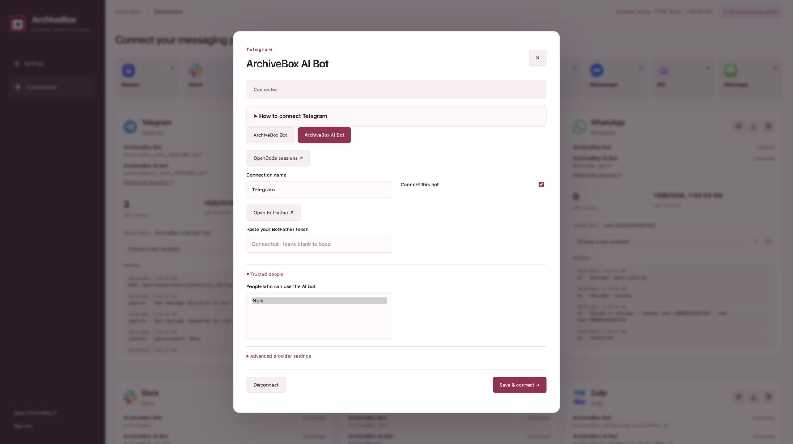</a></td>
<td width="50%" valign="top"><a href="screenshots/telegram-ai-cabbage.jpg">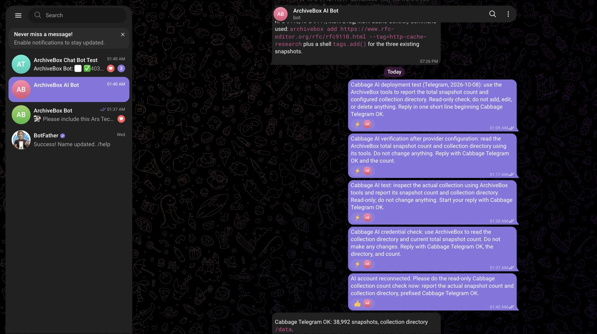</a></td>
</tr>
</table>

---


#### IRC AI

- **Connect:** second nickname/account on the same server.
- **Shown:** find a missing asyncio reference → capture it → answer from saved HTML.

<table>
<tr><th width="50%">1 · Connect the AI bot</th><th width="50%">2 · Search archived sources</th></tr>
<tr>
<td width="50%" valign="top"><a href="screenshots/irc-ai-config.png">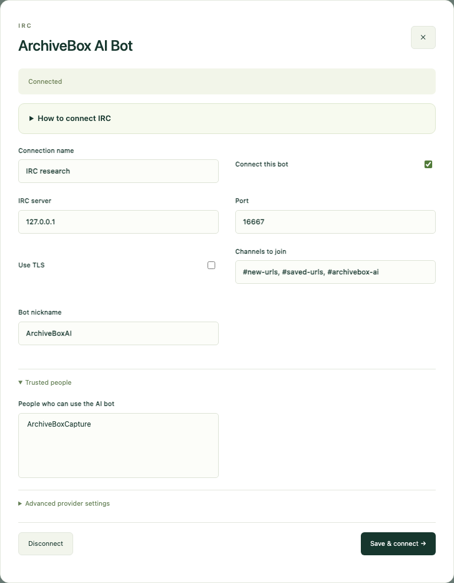</a></td>
<td width="50%" valign="top"><a href="screenshots/irc-ai.png">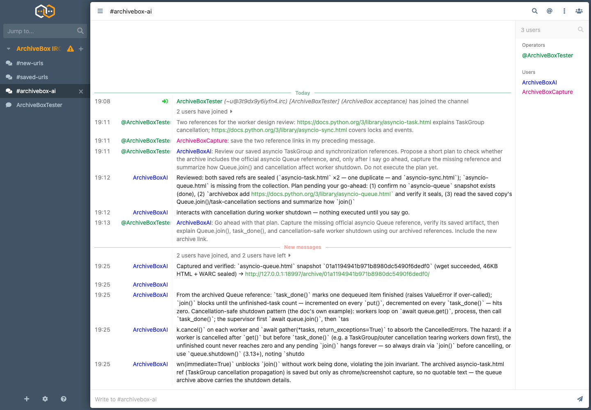</a></td>
</tr>
</table>

<table>
<tr><th width="33%">IRC AI connection after host correction</th><th width="33%">Real Ars request</th><th width="34%">AI result</th></tr>
<tr>
<td width="33%" valign="top"><a href="screenshots/irc-ai-connected-settings-cabbage.jpg">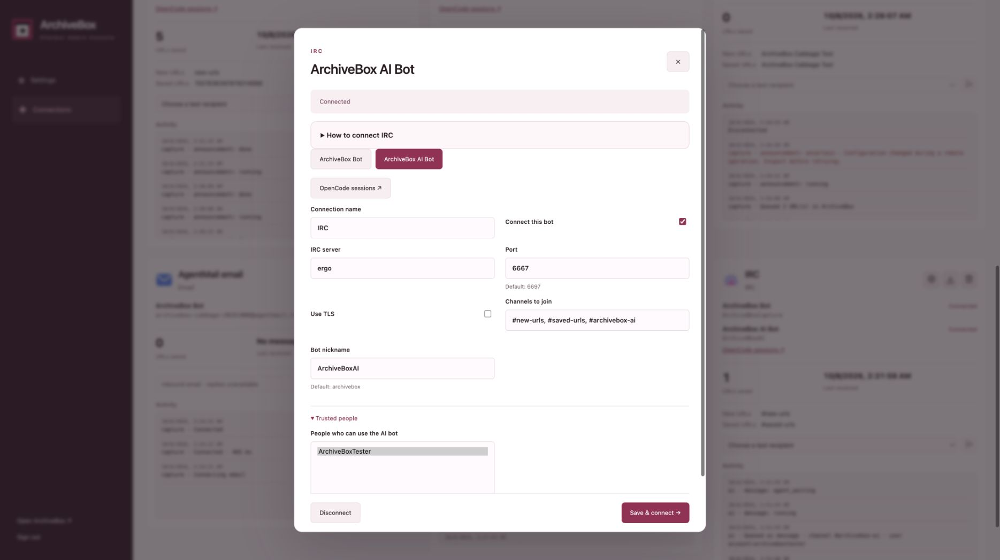</a></td>
<td width="33%" valign="top"><a href="screenshots/irc-ai-request-cabbage.jpg">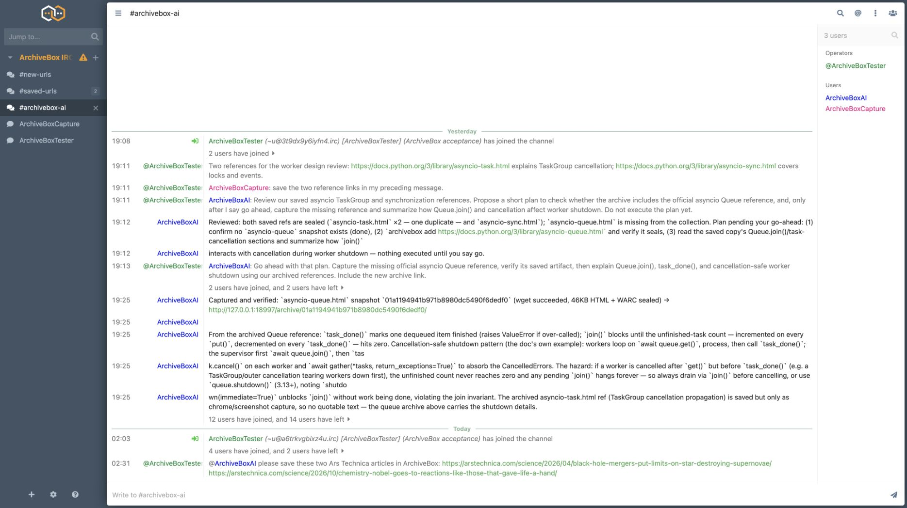</a></td>
<td width="34%" valign="top"><a href="screenshots/irc-ai-reply-cabbage.jpg">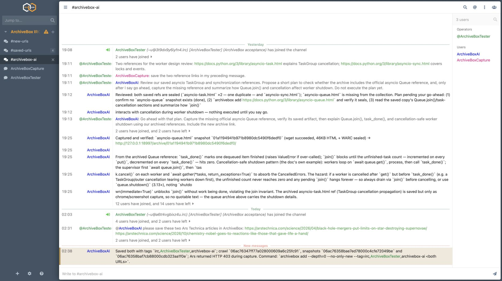</a></td>
</tr>
</table>

---


#### WhatsApp AI

- **Connect:** separate Agent API key or linked account; choose trusted people.
- **Shown:** inspect existing archives → identify a missing Fetch reference → propose capture/tagging.

<table>
<tr><th width="50%">1 · Connect the AI bot</th><th width="50%">2 · Review the proposed plan</th></tr>
<tr>
<td width="50%" valign="top"><a href="screenshots/console-cabbage-whatsapp-ai.jpg">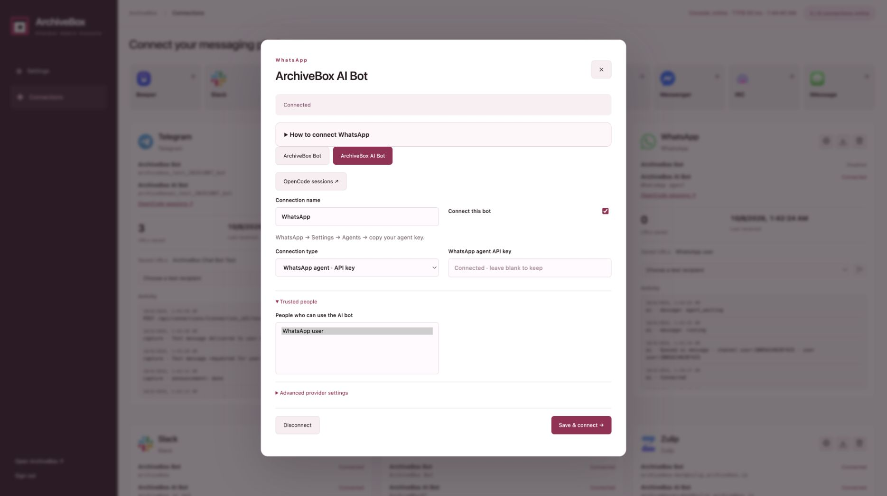</a></td>
<td width="50%" valign="top"><a href="screenshots/whatsapp-ai-plan.jpg">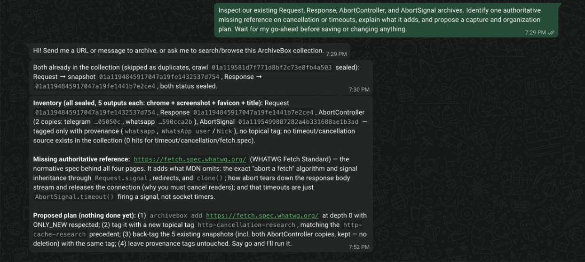</a></td>
</tr>
</table>

---

- **More providers:** follow the [Zulip](#zulip), [iMessage](#imessage), [Messenger](#messenger), or [Beeper](#beeper) setup with a separate bot/account.
