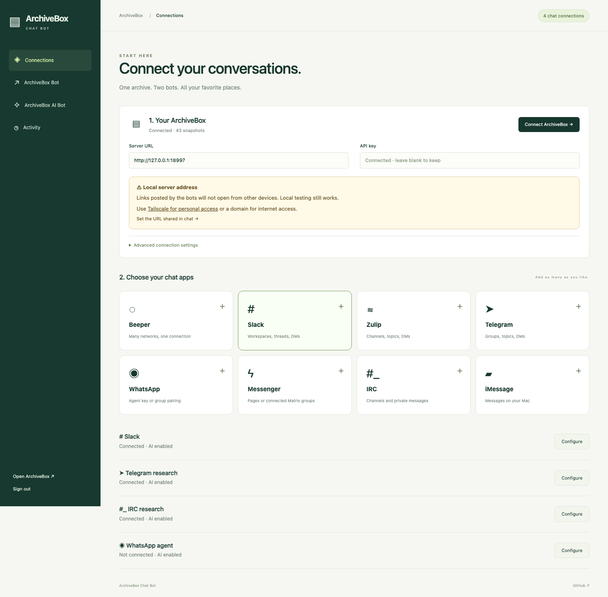
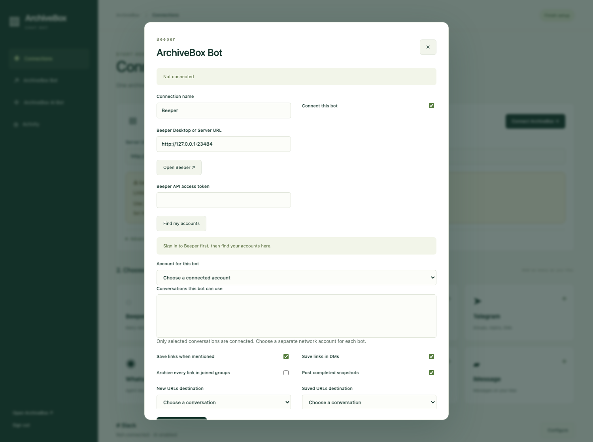
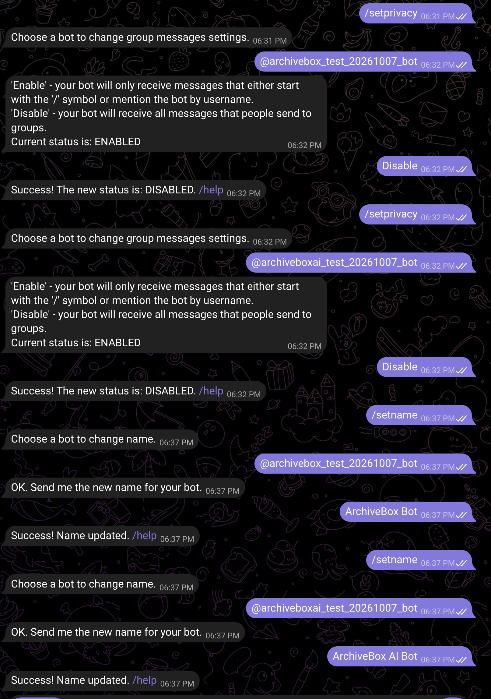
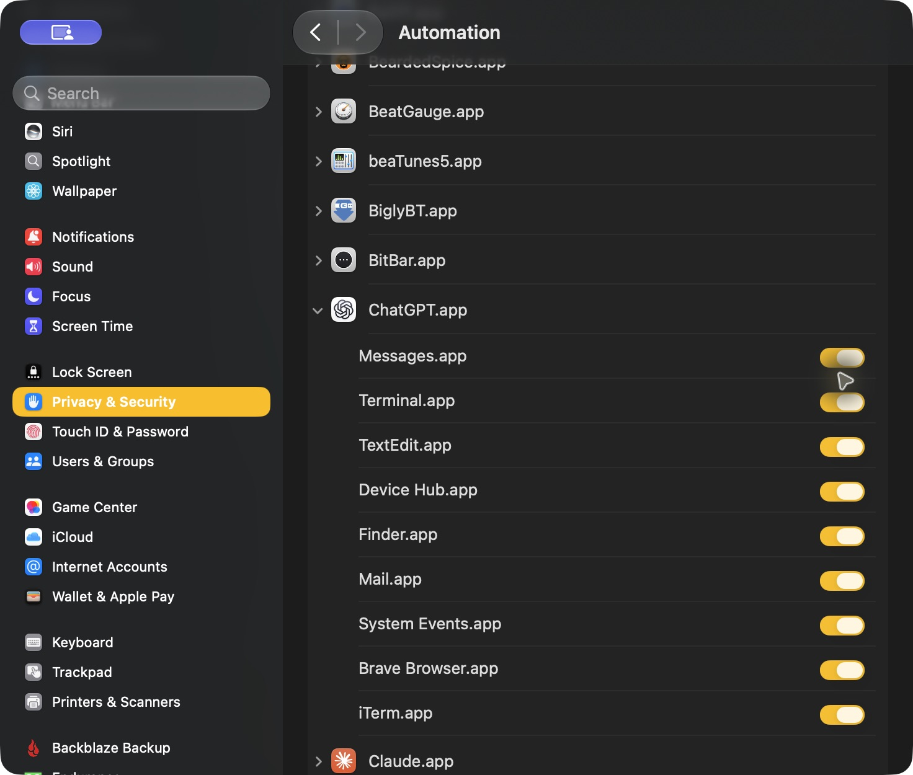
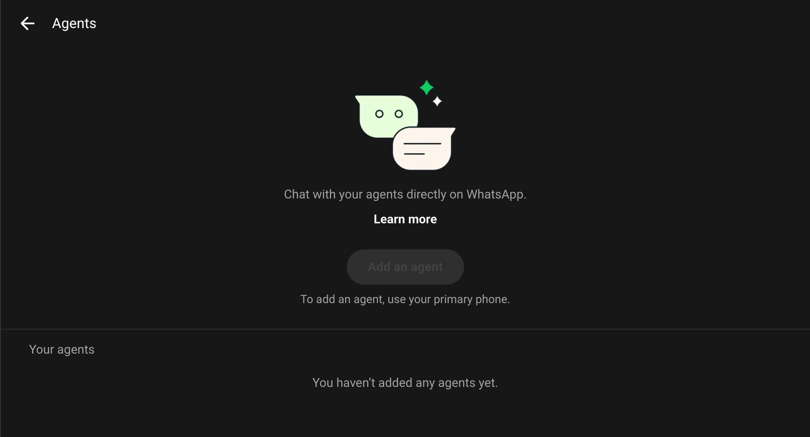
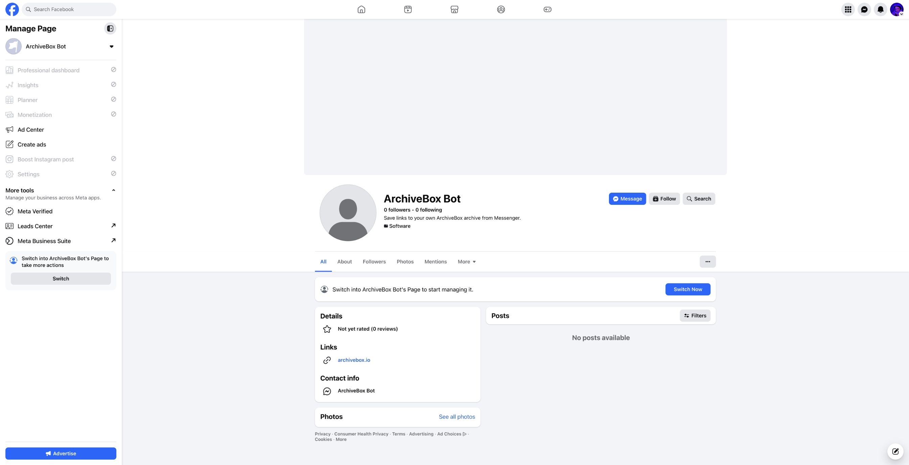
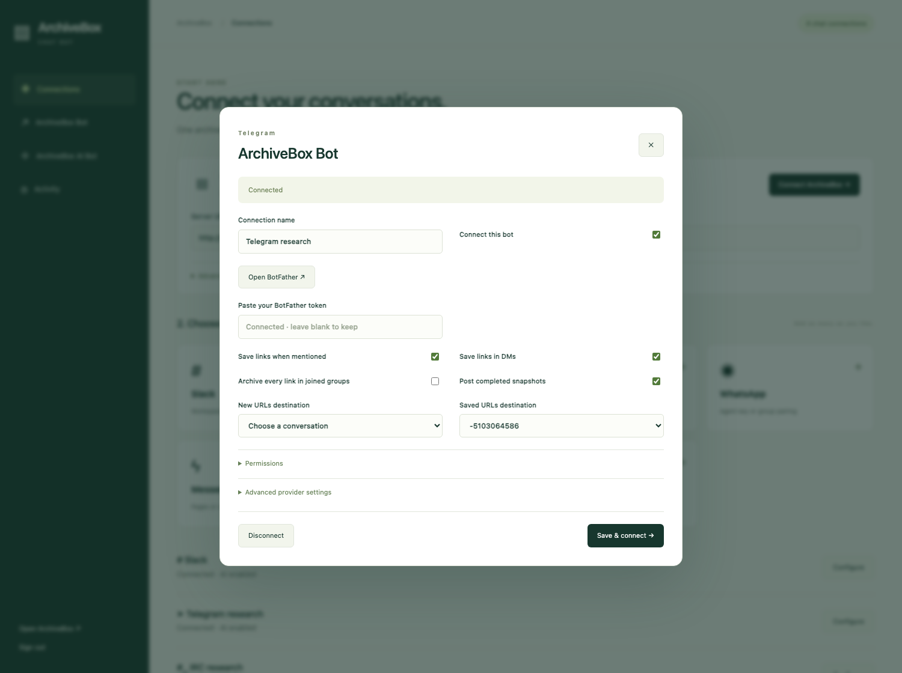
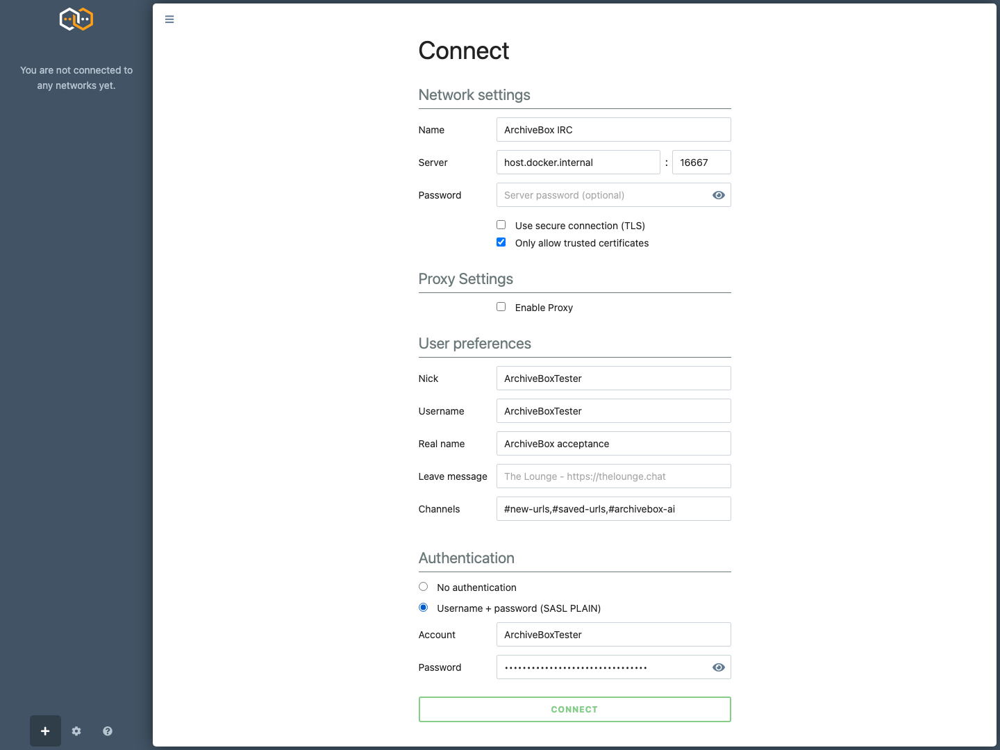
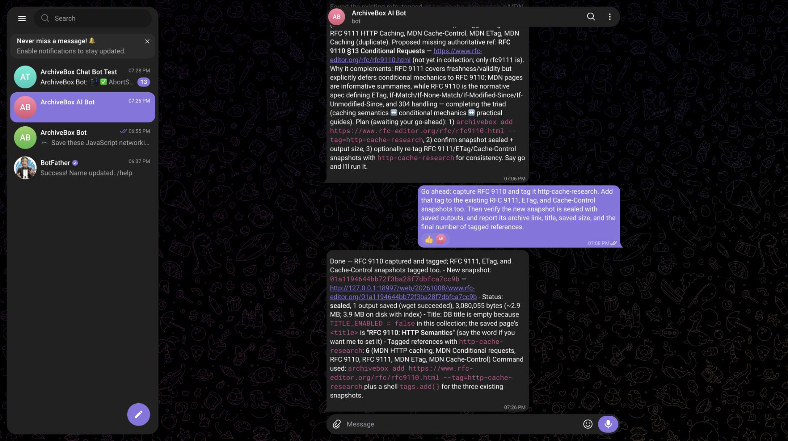

<div align="center">

# 📚 ArchiveBox Chat Bot

**Save links. Archive conversations. Put your archive to work.**

[](https://github.com/ArchiveBox/archivebox-chat-bot/actions/workflows/check.yml)
[](LICENSE)


**Beeper · Slack · Zulip · Telegram · WhatsApp · IRC · iMessage · Messenger**

[ArchiveBox Bot](#-archivebox-bot) · [ArchiveBox AI Bot](#-archivebox-ai-bot) · [Setup](#connect-your-apps)

</div>

## ↗ ArchiveBox Bot

<table>
<tr><th width="33%">💬 Mention in a thread</th><th width="33%">✉ Send a DM</th><th width="33%">▧ Browse saved snapshots</th></tr>
<tr>
<td width="33%" valign="top"><a href="screenshots/slack-thread.jpg"></a></td>
<td width="33%" valign="top"><a href="screenshots/slack-dm.jpg"></a></td>
<td width="33%" valign="top"><a href="screenshots/zulip.jpg"></a></td>
</tr>
</table>

- **@mention the bot** → archive URLs from the latest 10 messages and your mention.
- **DM the bot** → archive the URLs you send.
- **Post in New URLs** → archive every shared link.
- **Open Saved URLs** → linked titles, original URLs, screenshots, 🌐, sizes, and personas.
- **Enable a group** → automatically archive every link posted there.
- **Choose permissions** → people, groups, commands, and bot preferences.
- **Use several apps together** → one console, one Docker service, one ArchiveBox server.

<table>
<tr><th width="33%">Telegram · saved references</th><th width="33%">WhatsApp · capture from a DM</th><th width="33%">IRC · saved URLs</th></tr>
<tr>
<td width="33%"><a href="screenshots/telegram-capture.jpg"></a></td>
<td width="33%"><a href="screenshots/whatsapp-capture.jpg"></a></td>
<td width="33%"><a href="screenshots/irc-capture.png"></a></td>
</tr>
</table>

### Connect your apps

```bash
git clone https://github.com/ArchiveBox/archivebox-chat-bot.git
cd archivebox-chat-bot
docker compose up -d --build
docker compose exec archivebox-chat-bot cat /data/admin-password
```

**[Open setup → localhost:8001](http://localhost:8001)**

1. **Connect ArchiveBox** — server URL + API key.
2. **Choose a chat app** — connect its bot or pair its account.
3. **Choose conversations** — New URLs, Saved URLs, and groups to archive.

<a href="screenshots/console.png"></a>

- **Personal access:** use [Tailscale](https://tailscale.com/kb/1153/enabling-https).
- **Internet access:** use your own domain and HTTPS.
- **Local testing:** `localhost` / `127.0.0.1` work; the console warns that chat links will not open on other devices. Set **Public URL** to the address your readers can reach.

| App | Connect | Conversations |
|---|---|---|
| **Beeper** | Desktop/Server URL + API token → choose account and conversations | Shared connector for Beeper networks; selected chats only |
| **Slack** | Preconfigured app → install → bot & app tokens | Channels, threads, DMs; creates New URLs / Saved URLs |
| **Zulip** | Server URL + bot email + API key | Channels, topics, DMs; creates private New URLs / Saved URLs |
| **Telegram** | BotFather token | Existing groups, topics, DMs; disable bot privacy for group-wide capture |
| **WhatsApp** | Agent API key, or Linked Devices QR pairing | Agent key: creator DMs; paired account: groups and DMs |
| **IRC** | Server + nickname; account login when required | Existing channels and private messages |
| **iMessage** | Messages on a Mac with [imsg](https://github.com/openclaw/imsg) | Existing conversations; local Mac or SSH from Docker |
| **Messenger** | Facebook Page credentials, or an existing [Matrix bridge](https://github.com/mautrix/meta) | Page conversations; personal groups through Matrix |

### Beeper

1. Connect your networks in **Beeper Desktop** or **Beeper Server**.
2. Choose **Beeper** in the console → enter its URL and API access token.
3. Click **Find my accounts** → choose the bot account and allowed conversations.

<a href="screenshots/beeper-setup.png"></a>

- One transport for Beeper's connected networks; same capture settings and permissions.
- Only selected conversations are read; separate bot identities require separate network accounts.
- [Official headless server setup](https://github.com/beeper/cli#2-local-beeper-server-self-hosted-managed-by-the-cli); iMessage still needs a Mac.
- Beeper runs separately; its server binary is not bundled in this image.
- **Verified:** real macOS and Docker server startup, API discovery, sign-in requirement.
- **Pending:** signed-in message, reaction, media, group, and AI acceptance.

<details>
<summary><b>Live verification by provider</b></summary>

| Provider | Verified | Still needed |
|---|---|---|
| Slack | Mentions, DMs, saved cards, multi-step AI | Marketplace approval |
| Zulip | Topics, DMs, reactions, uploaded snapshot cards | Multi-step AI screenshot |
| Telegram | Human DMs/group mentions, images, reactions, multi-step AI | — |
| WhatsApp Agent | Real URLs captured and screenshots delivered | Multi-step AI completion; paired-account groups |
| IRC | SASL, contextual capture, saved URLs, multi-step AI | — |
| iMessage | Real Messages send, history/watch, self-message filtering | Independent sender capture and AI |
| Messenger | Dedicated app, Page, credentials | Live webhook capture and AI |
| Beeper | Actual Desktop/Server API readiness in macOS and Docker | Authenticated account tests |

</details>

### Provider setup

<table>
<tr><th width="33%">Telegram · create your bots</th><th width="33%">Telegram · add them to a group</th><th width="33%">iMessage · connect Messages</th></tr>
<tr>
<td width="33%" valign="top"><a href="screenshots/telegram-setup.jpg"></a></td>
<td width="33%" valign="top"><a href="screenshots/telegram-group-config.jpg"></a></td>
<td width="33%" valign="top"><a href="screenshots/imessage-setup.png"></a></td>
</tr>
</table>


<table>
<tr><th width="33%">Slack · installed bot</th><th width="33%">WhatsApp · Agents</th><th width="33%">Messenger · dedicated Page</th></tr>
<tr>
<td width="33%"><a href="screenshots/slack-setup.jpg"></a></td>
<td width="33%"><a href="screenshots/whatsapp-setup.jpg"></a></td>
<td width="33%"><a href="screenshots/messenger-setup.jpg"></a></td>
</tr>
<tr><th>Telegram · bot preferences</th><th>IRC · connect a client</th><th>Shared console</th></tr>
<tr>
<td><a href="screenshots/telegram-config.png"></a></td>
<td><a href="screenshots/irc-setup.png"></a></td>
<td><a href="screenshots/console.png"></a></td>
</tr>
</table>

### Groups & commands

- Invite **ArchiveBox Bot** into a group and send a message to discover it in the console.
- Choose **Archive every link** for individual groups or all joined groups.
- Select administrators by name in **Permissions** to let them change group settings from chat.

| Command | Action |
|---|---|
| `/archivebox save <URLs>` | Capture links |
| `/archivebox search <words>` | Find saved pages |
| `/archivebox auto on` / `off` | Change this group’s automatic capture |
| `/archivebox status` | Check ArchiveBox |
| `/archivebox help` | Show commands |

- **Telegram:** `/save`, `/search`, `/auto`, `/status`, `/help` also work.
- **Zulip:** DM a command or put it after a mention.
- **IRC / iMessage:** `/archivebox …` in ordinary message text.
- Captures use depth **0**, the selected persona, and tags for the **provider + sender**.
- History comes from the provider where available; other providers retain the messages received while connected.
- Reactions and media follow each provider’s capabilities. IRC and standard iMessage do not provide reliably targeted reactions; Messenger Pages have text replies.

<details>
<summary><b>ArchiveBox & deployment options</b></summary>

- Start ArchiveBox alongside the bot: `docker compose --profile archivebox up -d --build`.
- Docker network: `http://archivebox:5797`; server on host: `http://host.docker.internal:5797`.
- Set **Public URL** to the ArchiveBox address people can open.
- Standard split API/admin hostnames are discovered automatically; an internal admin override is available.
- Slack Socket Mode and Telegram polling do not need a public webhook.
- Facebook Pages, Telegram webhooks, and Slack OAuth need an HTTPS console URL.
- Back up the **bridge_data** volume: settings, credentials, conversation history, and pending jobs.
- Run one service per data volume. Update with `git pull --ff-only && docker compose up -d --build`.

</details>

<details>
<summary><b>Activity, credentials & recovery</b></summary>

- **Activity** links captures and agent sessions; **Recover answer** reads an existing task without repeating its captures. Uncertain message delivery requires review before retrying.
- Jobs remain bound to their original server, connection, and bot identity.
- The console requires authentication and CSRF protection. Tokens are redacted from its API.
- Blank password fields preserve credentials. Protect the Docker volume and use HTTPS when exposing the console.
- Change the console password in **Activity → Console password**.
- Revoke provider credentials or disconnect the account to remove chat access.
- Removing the bot’s volume does not delete ArchiveBox snapshots or chat messages.

</details>

<details>
<summary><b>Development & real-service checks</b></summary>

```bash
uv sync
cd connectors && npm ci && npm run build && cd ..
uv run archivebox-chat-bot
uv run python -m pytest -xq tests/local
uv run ruff check .
```

- Python owns the shared capture/agent behavior, durable queue, permissions, and console.
- [Beeper Client API](https://developers.beeper.com/desktop-api/) provides the shared Desktop/Server transport with durable message cursors and delivery confirmation.
- [Chat SDK](https://chat-sdk.dev/docs) connects Telegram, WhatsApp, and Messenger in a supervised Node subprocess.
- Native Slack/Zulip adapters preserve their thread, card, and agent features; IRC uses pydle; iMessage uses imsg.
- Live tests use real services and persisted results. Credential schemas and environment variables are in `tests/test_*_live.py`.
- Screenshots show actual conversations and captures; no simulated bot messages.

</details>

## ✧ ArchiveBox AI Bot

<table>
<tr><th width="33%">Slack · HTTP caching collection</th><th width="33%">Telegram · capture, tag, verify</th><th width="33%">IRC · research saved references</th></tr>
<tr>
<td width="33%" valign="top"><a href="screenshots/slack-ai-task.jpg"></a></td>
<td width="33%" valign="top"><a href="screenshots/telegram-ai.jpg"></a></td>
<td width="33%" valign="top"><a href="screenshots/irc-ai.png"></a></td>
</tr>
</table>

- **DM or @mention the AI bot** → research, capture, organize, and verify your archive.
- **Follow up in the conversation** → include the recent messages and previous replies.
- **Open ArchiveBox → Agent** → inspect each task’s persisted session and tool results.
- **Use your existing OpenCode setup** → providers, credentials, tools, and session database.
- **Choose trusted people** → control who can start agent tasks.
- **Long-running tasks** → results are tracked in the existing session and survive bot restarts.

### Connect the AI bot

1. Open **ArchiveBox AI Bot** in the console.
2. Choose a provider and connect its **second bot/account**.
3. Select **Trusted people** and enable it.

| Provider | AI connection |
|---|---|
| **Beeper** | Same Beeper server; select a second network account and its allowed conversations |
| **Slack** | Second preconfigured app; native agent interface, status, and Stop |
| **Zulip** | Second bot email + API key |
| **Telegram** | Second BotFather token |
| **WhatsApp** | Separate agent API key or second linked account |
| **IRC** | Second nickname/account |
| **iMessage** | Separate Mac/account for distinct bot identities |
| **Messenger** | Second Page or Matrix account |

<a href="screenshots/slack-ai-config.jpg"></a>

- Every invocation starts a titled session in the existing ArchiveBox collection directory.
- **Agent preferences** customize the prompt; trusted users can exercise the configured agent’s tools.
- AI replies and sessions stay separate from the ArchiveBox Bot’s capture workflow.

<details>
<summary><b>Slack AgentExchange & Apps marketplace</b></summary>

| Distribution | Status |
|---|---|
| Self-hosted Slack apps | Socket Mode supported |
| HTTPS Events + OAuth | Implemented for your own public endpoint and Slack app |
| Public AgentExchange / Apps listing | **Not submitted or approved** |

- [Slack requires 10+ active workspaces during review](https://docs.slack.dev/changelog/2026/09/01/slack-marketplace-install-requirement/).
- [Marketplace apps require HTTPS events instead of Socket Mode](https://docs.slack.dev/apis/events-api/using-socket-mode/).
- Public submission also needs support/privacy URLs, reviewer access, and approval from Slack.
- Native Slack agent support does not publish a marketplace listing automatically.

</details>
