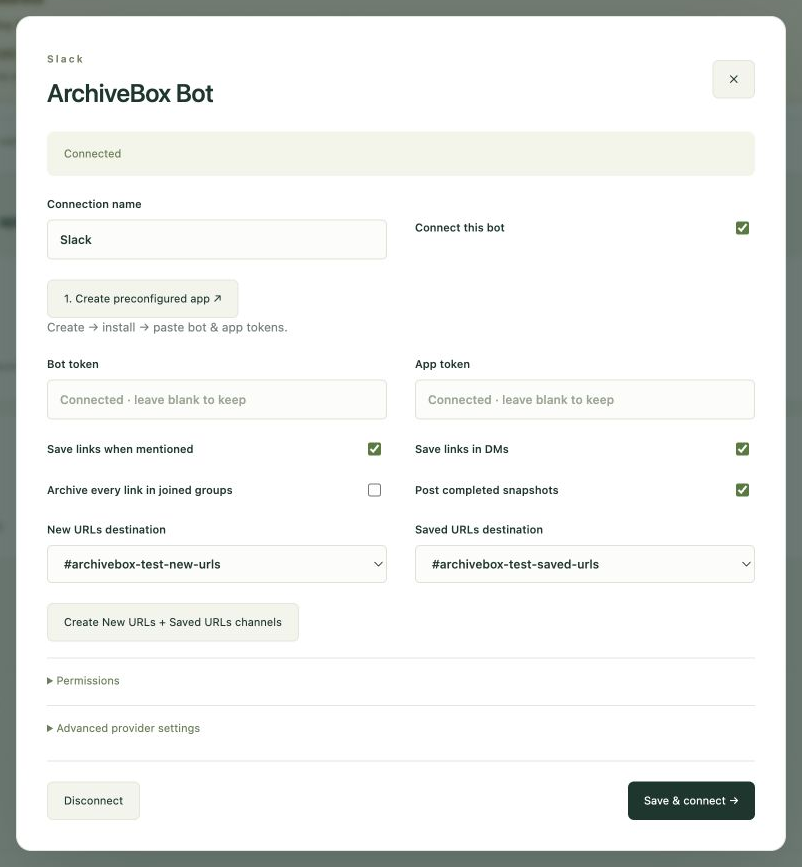
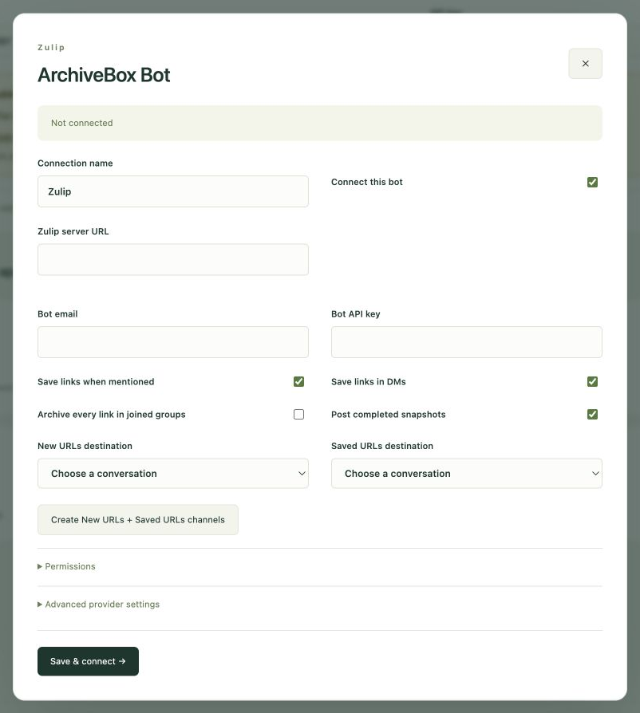
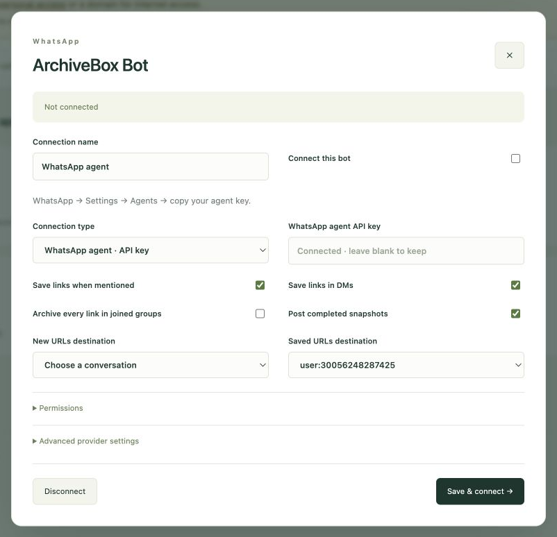
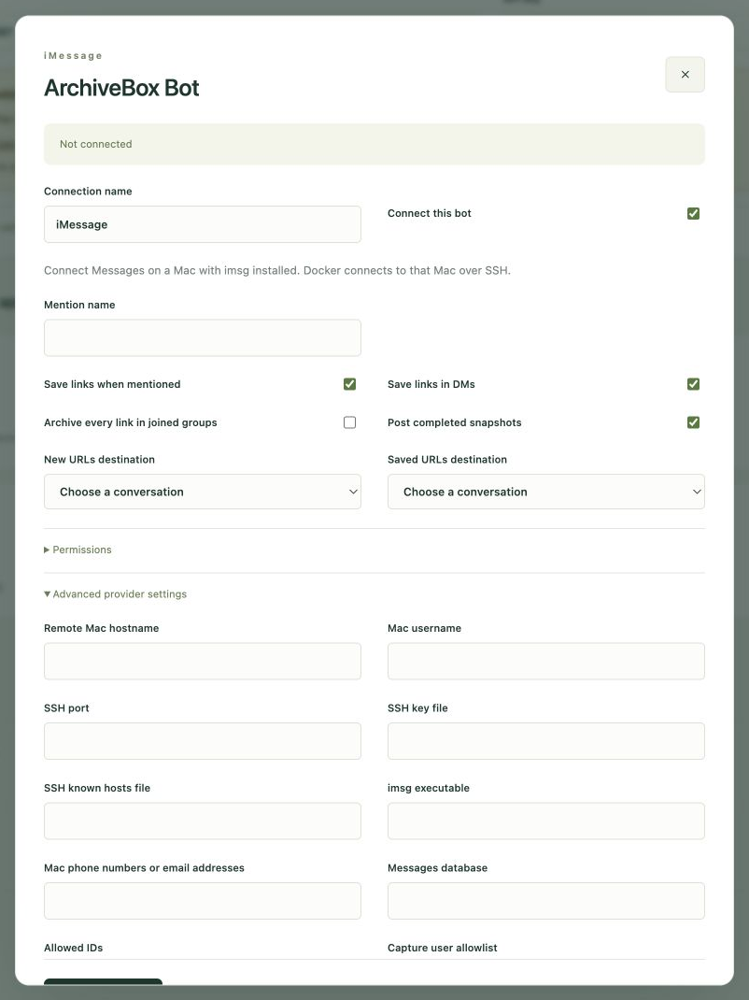
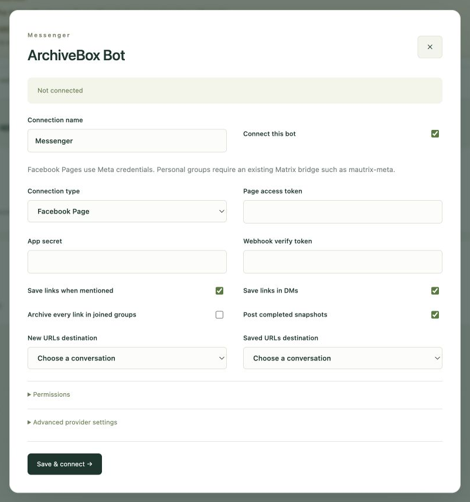
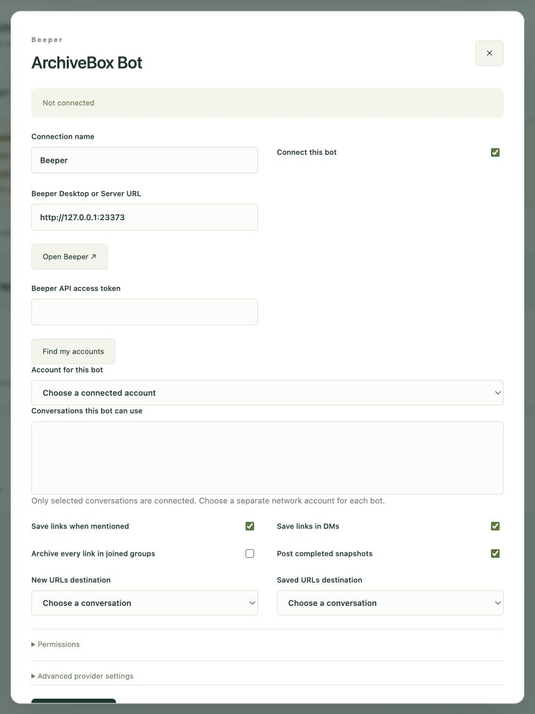
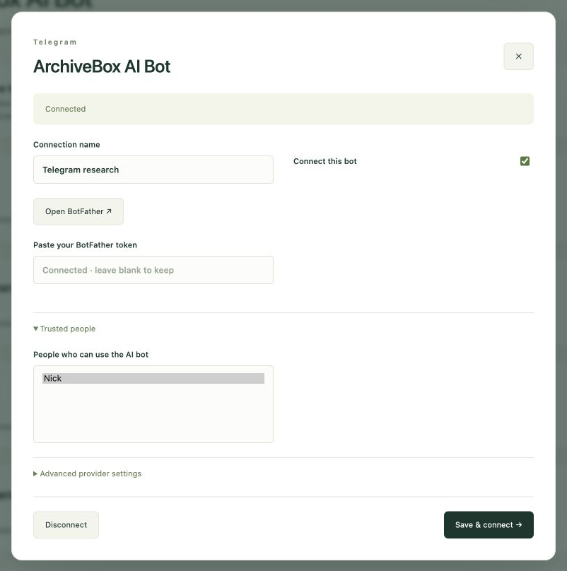
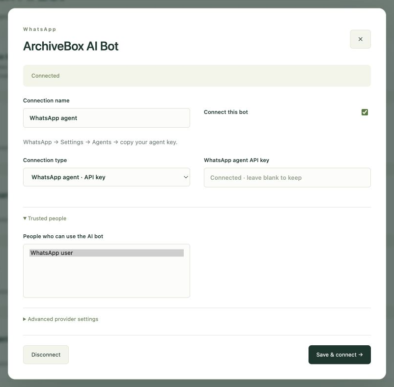

<div align="center">

# 📚 ArchiveBox Chat Bot

**Your chats → your archive.**

[](https://github.com/ArchiveBox/archivebox-chat-bot/actions/workflows/check.yml) [](LICENSE) 

[ArchiveBox Bot](#-archivebox-bot) · [ArchiveBox AI Bot](#-archivebox-ai-bot) · [Setup](#connect-your-apps)

[Slack](#slack) · [Zulip](#zulip) · [Telegram](#telegram) · [WhatsApp](#whatsapp) · [IRC](#irc) · [iMessage](#imessage) · [Messenger](#messenger) · [Beeper](#beeper)

</div>

## ↗ ArchiveBox Bot

- **@mention** → save URLs from your message + the latest 10 messages.
- **DM / New URLs** → save every URL you send.
- **Groups** → optionally archive every link shared there.
- **Saved URLs** → linked title, screenshot, original URL, 🌐, **Saved 475 KB**, persona.
- **Tags** → provider + sender + group: `slack,bob,accounting`; DMs omit the group.

### Connect your apps

<details>
<summary><b>🐳 Docker → ArchiveBox URL + API key → chat provider</b></summary>

```bash
git clone https://github.com/ArchiveBox/archivebox-chat-bot.git
cd archivebox-chat-bot
docker compose up -d --build
docker compose exec archivebox-chat-bot cat /data/admin-password
```

1. **[Open setup](http://localhost:8001)** → ArchiveBox server URL + API key.
2. **Choose a provider below** → connect ArchiveBox Bot.
3. **Pick conversations** → New URLs, Saved URLs, groups, permissions.

<a href="screenshots/console.png"></a>

- **Reachable links:** [Tailscale](https://tailscale.com/kb/1153/enabling-https) for personal use; a domain + HTTPS for internet access.
- **Localhost / 127.0.0.1:** allowed with a warning; set **Public URL** so links work on other devices.

</details>

### Providers

#### Slack

- **Connect:** create the preconfigured app → install → paste bot + app tokens.
- **Use:** invite the bot to channels; mention it in a thread or send a DM.
- **Destinations:** create **New URLs + Saved URLs** in the console. Socket Mode needs no public webhook.

<table>
<tr><th width="33%">1 · Set up the Slack app</th><th width="33%">2 · Configure the bot</th><th width="33%">3 · Mention in a thread</th></tr>
<tr>
<td width="33%" valign="top"><a href="screenshots/slack-setup.jpg"></a></td>
<td width="33%" valign="top"><a href="screenshots/slack-config.png"></a></td>
<td width="33%" valign="top"><a href="screenshots/slack-thread.jpg"></a></td>
</tr>
</table>

<table>
<tr><th width="50%">Or send a DM</th><th width="50%">Browse Saved URLs</th></tr>
<tr>
<td width="50%" valign="top"><a href="screenshots/slack-dm.jpg"></a></td>
<td width="50%" valign="top"><a href="screenshots/slack-saved.jpg"></a></td>
</tr>
</table>

#### Zulip

- **Connect:** create a generic bot → enter server URL, bot email, API key.
- **Use:** topics, mentions, DMs; create private **New URLs + Saved URLs** channels.

<table>
<tr><th width="50%">1 · Connect & choose channels</th><th width="50%">2 · Browse Saved URLs</th></tr>
<tr>
<td width="50%" valign="top"><a href="screenshots/zulip-config.png"></a></td>
<td width="50%" valign="top"><a href="screenshots/zulip.jpg"></a></td>
</tr>
</table>

#### Telegram

- **Connect:** [BotFather](https://t.me/BotFather) token → add to group → choose destinations.
- **Use:** DMs, mentions, topics; disable bot privacy for group-wide capture.
- **Commands:** `/save`, `/search`, `/auto`, `/status`, `/help`; polling needs no public webhook.

<table>
<tr><th width="33%">1 · Add to your group</th><th width="33%">2 · Choose bot preferences</th><th width="33%">3 · Save references</th></tr>
<tr>
<td width="33%" valign="top"><a href="screenshots/telegram-group-config.jpg"></a></td>
<td width="33%" valign="top"><a href="screenshots/telegram-config.png"></a></td>
<td width="33%" valign="top"><a href="screenshots/telegram-capture.jpg"></a></td>
</tr>
</table>

<details>
<summary><b>BotFather · names & group privacy</b></summary>

<a href="screenshots/telegram-setup.jpg"></a>

</details>

#### WhatsApp

- **Connect:** Agent API key for creator DMs, or **Linked Devices** QR pairing for an account.
- **Use:** send URLs in a DM; linked accounts also support groups.
- **Live evidence:** Agent DM capture ✅ · linked-account groups pending.

<table>
<tr><th width="33%">1 · Set up an agent</th><th width="33%">2 · Connect WhatsApp</th><th width="33%">3 · Save from a DM</th></tr>
<tr>
<td width="33%" valign="top"><a href="screenshots/whatsapp-setup.jpg"></a></td>
<td width="33%" valign="top"><a href="screenshots/whatsapp-config.png"></a></td>
<td width="33%" valign="top"><a href="screenshots/whatsapp-capture.jpg"></a></td>
</tr>
</table>

#### IRC

- **Connect:** server + nickname + channels; TLS/SASL settings when required.
- **Use:** mentions, private messages, auto-archive channels; saved cards use text links.

<table>
<tr><th width="50%">1 · Configure the bot</th><th width="50%">2 · Browse Saved URLs</th></tr>
<tr>
<td width="50%" valign="top"><a href="screenshots/irc-config.png"></a></td>
<td width="50%" valign="top"><a href="screenshots/irc-capture.png"></a></td>
</tr>
</table>

#### iMessage

- **Connect:** Mac + Messages + [imsg](https://github.com/openclaw/imsg); allow Full Disk Access and Messages Automation.
- **Use:** existing conversations; local Mac or Docker → SSH.
- **Live evidence:** send/history/watch ✅ · incoming capture pending.

<table>
<tr><th width="50%">1 · Allow Messages access</th><th width="50%">2 · Connect the Mac</th></tr>
<tr>
<td width="50%" valign="top"><a href="screenshots/imessage-setup.png"></a></td>
<td width="50%" valign="top"><a href="screenshots/imessage-config.png"></a></td>
</tr>
</table>

<details>
<summary><b>Docker → Mac prerequisites</b></summary>

- SSH key + verified `known_hosts`, readable by container UID **1000**.
- Set the Mac's absolute `imsg` path; Compose does not provision the Mac or SSH access.

</details>

#### Messenger

- **Connect:** Facebook Page credentials + HTTPS message webhook; or an existing [Matrix bridge](https://github.com/mautrix/meta).
- **Use:** Page conversations; personal groups through Matrix.
- **Live evidence:** app/Page created ✅ · incoming capture pending.

<table>
<tr><th width="50%">1 · Create a Page</th><th width="50%">2 · Configure Messenger</th></tr>
<tr>
<td width="50%" valign="top"><a href="screenshots/messenger-setup.jpg"></a></td>
<td width="50%" valign="top"><a href="screenshots/messenger-config.png"></a></td>
</tr>
</table>

<details>
<summary><b>Meta webhook</b></summary>

- Register `https://<console>/connections/<connection-id>/capture/webhook` with your matching verify token.
- Subscribe the Page to message events; use `/ai/webhook` for ArchiveBox AI Bot.

</details>

#### Beeper

- **Connect networks once:** [Beeper Desktop/Server](https://github.com/beeper/cli#2-local-beeper-server-self-hosted-managed-by-the-cli) → URL + API token → **Find my accounts**.
- **Choose:** one network account + allowed conversations per bot; Beeper runs separately, iMessage still needs a Mac.
- **Live evidence:** macOS/Docker readiness ✅ · signed-in chats, media, reactions pending.

<table>
<tr><th width="50%">1 · Configure Beeper</th><th width="50%">2 · Check the server</th></tr>
<tr>
<td width="50%" valign="top"><a href="screenshots/beeper-config.png"></a></td>
<td width="50%" valign="top"><a href="screenshots/beeper-setup.png"></a></td>
</tr>
</table>

<details>
<summary><b>Docker → Beeper address</b></summary>

- Host address: `http://host.docker.internal:<port>`; container `localhost` points at the bot itself.

</details>

### Groups & commands

- Invite the bot → send a message → select the group in the console.
- Enable **Archive every link** per group or across joined groups; choose administrators under **Permissions**.

| Command | Action |
|---|---|
| `/archivebox save <URLs>` | Capture links |
| `/archivebox search <words>` | Find saved pages |
| `/archivebox auto on` / `off` | Toggle this group's automatic capture |
| `/archivebox status` | Check ArchiveBox |
| `/archivebox help` | Show commands |

<details>
<summary><b>Capture & provider details</b></summary>

- Capture depth **0**, selected persona.
- History: provider API where available, otherwise messages received while connected.
- Zulip: commands in DMs or after a mention. IRC/iMessage: commands as ordinary message text.
- Reactions/media depend on the provider; IRC/iMessage lack reliably targeted reactions, Messenger Pages use text replies.

</details>

### Administration

<details>
<summary><b>Deployment & updates</b></summary>

- Include ArchiveBox: `docker compose --profile archivebox up -d --build`.
- ArchiveBox inside Compose: `http://archivebox:5797`; on the host: `http://host.docker.internal:5797`.
- **Public URL** is the address readers open; split API/admin hosts are discovered automatically.
- Back up **bridge_data**; run one service per data volume.
- Update: `git pull --ff-only && docker compose up -d --build`.

</details>

<details>
<summary><b>Credentials & recovery</b></summary>

- **Activity** → jobs, sessions, **Recover answer**, console password.
- Pending jobs retain their original server/connection; review uncertain delivery before retrying.
- Blank credential fields preserve secrets. Protect the volume; use HTTPS for remote access.
- Revoke credentials to remove access. Removing bot data preserves snapshots and chat messages.

</details>

<details>
<summary><b>Development</b></summary>

```bash
uv sync
cd connectors && npm ci && npm run build && cd ..
uv run archivebox-chat-bot
uv run python -m pytest -xq tests/local
uv run ruff check .
```

- Python: shared capture/agent engine, queue, permissions, console.
- Transports: [Beeper API](https://developers.beeper.com/desktop-api/), [Chat SDK](https://chat-sdk.dev/docs), Slack/Zulip APIs, pydle, imsg.
- Live tests: `tests/test_*_live.py`. Real screenshots; pending evidence marked per provider.

</details>

## ✧ ArchiveBox AI Bot

- **DM / @mention** → research, capture, tag, organize, and verify.
- **Follow up** → include recent messages and previous replies.
- **ArchiveBox → Agent** → inspect each new session and tool results.
- **Existing OpenCode** → providers, credentials, tools, session database; tasks survive restarts.

### Connect the AI bot

1. **ArchiveBox AI Bot** in the console → connect a second bot/account.
2. **Trusted people** → choose who can run tasks.
3. **Agent preferences** → optional prompt → enable.

### AI providers

#### Slack AI

- **Connect:** second preconfigured Slack app; native agent status and Stop controls.
- **Shown:** plan → approval → capture HTTP caching references → tag and verify.

<table>
<tr><th width="50%">1 · Configure ArchiveBox AI Bot</th><th width="50%">2 · Complete a research task</th></tr>
<tr>
<td width="50%" valign="top"><a href="screenshots/slack-ai-config.jpg"></a></td>
<td width="50%" valign="top"><a href="screenshots/slack-ai-task.jpg"></a></td>
</tr>
</table>

#### Telegram AI

- **Connect:** second BotFather token; add ArchiveBox AI Bot to the group.
- **Shown:** capture RFC 9110 → tag existing caching references → verify six sources.

<table>
<tr><th width="50%">1 · Connect the AI bot</th><th width="50%">2 · Capture, tag & verify</th></tr>
<tr>
<td width="50%" valign="top"><a href="screenshots/telegram-ai-config.png"></a></td>
<td width="50%" valign="top"><a href="screenshots/telegram-ai.jpg"></a></td>
</tr>
</table>

#### IRC AI

- **Connect:** second nickname/account on the same server.
- **Shown:** find a missing asyncio reference → capture it → answer from saved HTML.

<table>
<tr><th width="50%">1 · Connect the AI bot</th><th width="50%">2 · Research archived sources</th></tr>
<tr>
<td width="50%" valign="top"><a href="screenshots/irc-ai-config.png"></a></td>
<td width="50%" valign="top"><a href="screenshots/irc-ai.png"></a></td>
</tr>
</table>

#### WhatsApp AI

- **Connect:** separate Agent API key or linked account; choose trusted people.
- **Shown:** inspect existing archives → identify a missing Fetch reference → propose capture/tagging. Execution pending.

<table>
<tr><th width="50%">1 · Connect the AI bot</th><th width="50%">2 · Review the proposed plan</th></tr>
<tr>
<td width="50%" valign="top"><a href="screenshots/whatsapp-ai-config.png"></a></td>
<td width="50%" valign="top"><a href="screenshots/whatsapp-ai-plan.jpg"></a></td>
</tr>
</table>

#### Other AI providers

| Provider | Second identity | Live task evidence |
|---|---|---|
| [Zulip](#zulip) | Generic bot email + API key | Multi-step capture pending |
| [iMessage](#imessage) | Separate Mac/account | Incoming task pending |
| [Messenger](#messenger) | Page or Matrix account | Incoming task pending |
| [Beeper](#beeper) | Second network account + allowed conversations | Signed-in task pending |

<details>
<summary><b>Slack AgentExchange & Apps marketplace</b></summary>

- **Not submitted or approved.** Self-hosted apps work independently of marketplace listing.
- Review requires [10+ active workspaces](https://docs.slack.dev/changelog/2026/09/01/slack-marketplace-install-requirement/), [HTTPS events rather than Socket Mode](https://docs.slack.dev/apis/events-api/using-socket-mode/), support/privacy URLs, and reviewer access.
- HTTPS Events + OAuth are implemented for your own public endpoint and Slack app.

</details>
